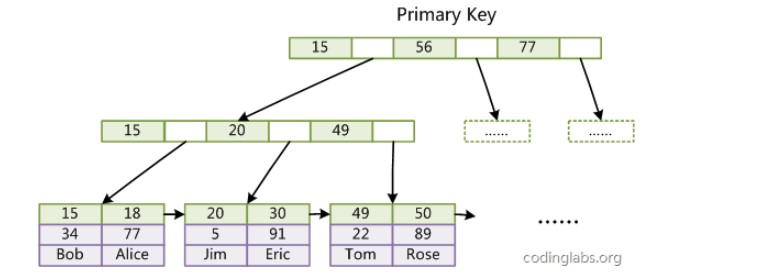
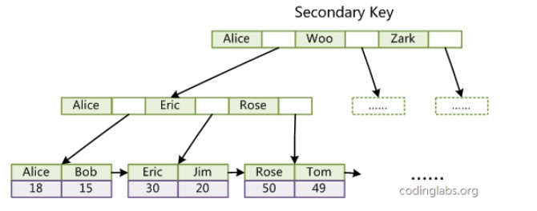

# 数据库

## 1. 基础

### 1.1 事物

**ACID**

* **Atomicity**  原子性，事物不可分
* **Consistency**  一致性，事物执行前后数据一致，即结果正确
* **Isolation**  隔离性，事物之间操作互不干扰
* **Durability**  持久性，一旦事务提交，则其所做的修改将会永远保存到数据库中。即使系统发生崩溃，事务执行的结果也不能丢失 

事务的 ACID 特性概念简单，但不是很好理解，主要是因为这几个特性不是一种平级关系：

- 只有满足一致性，事务的执行结果才是正确的。
- 在无并发的情况下，事务串行执行，隔离性一定能够满足。此时要只要能满足原子性，就一定能满足一致性。
- 在并发的情况下，多个事务并发执行，事务不仅要满足原子性，还需要满足隔离性，才能满足一致性。
- 事务满足持久化是为了能应对数据库崩溃的情况。

### 1.2 并发一致性

上面说了，并发事物需要满足原子性和隔离性才能满足一致性，而事务的隔离性很难保证，因此会出现很多并发一致性问题。 

**丢失更改**

T1 和 T2 两个事务都对一个数据进行修改，T1 先修改，T2 随后修改，随后TI提交，然后T2提交，T2 的修改覆盖了 T1 的修改。 

**脏读**

事物期间，读到的数据已被丢弃（另一个事物撤销了更改）而不自知。

**不可重复读**

事物期间，再次读取同一个数据与第一次读取结果不同。

**幻读**

事物期间，聚集函数两次执行结果不同。

产生并发不一致性问题主要原因是破坏了事务的隔离性，解决方法是通过并发控制来保证隔离性。并发控制可以通过**封锁**来实现，但是封锁操作需要用户自己控制，相当复杂。数据库管理系统提供了**事务的隔离级别**，让用户以一种更轻松的方式处理并发一致性问题。 

#### 1.2.1 封锁

**封锁粒度**

MySQL 中提供了两种封锁粒度：行级锁以及表级锁。

应该尽量只锁定需要修改的那部分数据，而不是所有的资源。锁定的数据量越少，发生锁争用的可能就越小，系统的并发程度就越高。

但是加锁需要消耗资源，锁的各种操作（包括获取锁、释放锁、以及检查锁状态）都会增加系统开销。因此封锁粒度越小，系统开销就越大。

在选择封锁粒度时，需要在锁开销和并发程度之间做一个权衡。

**封锁类型**

读写锁：

* 排它锁（Exclusive），简写为 X 锁，又称写锁。一个事务对数据对象 A 加了 X 锁，就可以对 A 进行读取和更新。加锁期间其它事务不能对 A 加任何锁。
* 共享锁（Shared），简写为 S 锁，又称读锁。一个事务对数据对象 A 加了 S 锁，可以对 A 进行读取操作，但是不能进行更新操作。加锁期间其它事务能对 A 加 S 锁，但是不能加 X 锁。

意向锁：

使用意向锁（Intention Locks）可以更容易地支持多粒度封锁。 MySQL中主要用来解决表锁和行锁共存的情况，试想一下，若事务 T 想要对表 A 加 X 锁，就需要先检测是否有其它事务对表 A 或者表 A 中的任意一行加了锁，那么就需要对表 A 的每一行都检测一次，这是非常耗时的。 

意向锁在原来的 X/S 锁之上引入了 IX/IS，IX/IS 都是表锁，用来表示一个事务想要在表中的某个数据行上加 X 锁或 S 锁。有以下两个规定：

- 一个事务在获得某个数据行对象的 S 锁之前，必须先获得表的 IS 锁或者更强的锁；
- 一个事务在获得某个数据行对象的 X 锁之前，必须先获得表的 IX 锁。

这样表锁只需检查IS或IX就可知道有没有行锁的存在。

**封锁协议**

1）三级封锁协议

* 一级封锁协议  修改数据时必须加X锁，事物结束时才能释放。解决丢失更改问题。因为不能同时有两个事务对同一个数据进行修改，那么事务的修改就不会被覆盖。 
* 二级封锁协议  一级协议的基础上，读取数据必须加 S 锁，读完立即释放，解决了脏读问题。因为如果一个事务在对数据 A 进行修改，根据 1 级封锁协议，会加 X 锁，那么就不能再加 S 锁了，也就是不会读入数据。 
* 三级封锁协议  在二级协议的基础上，读取数据必须加 S 锁，事物结束时才能释放，解决了不可重复读问题。因为读数据时，其它事务不能对该数据加 X 锁，从而避免了在读的期间数据发生改变。 

2）两段锁协议

加锁和解锁分为两个阶段进行。

可串行化调度是指，通过并发控制，使得并发执行的事务结果与某个串行执行的事务结果相同。

事务遵循两段锁协议是保证可串行化调度的充分条件。

#### 1.2.2 事物的隔离级别

**READ UNCOMMITTED（未提交读）**

允许读到其他事物未提交的数据。即事物修改的数据提交之前对其他事物可见。

**READ COMMITTED（已提交读）**

只能读取已经提交事物的数据。即事物修改的数据提交之前对其他事物不可见。

**REPEATABLE READ（可重复读）**

保证一个事物中多次读取一个数据结果相同。

**SERIALIZABLE（可串行化）**

任何两个事物不会同时执行。

## 2. SQL语句

字段名：使用反引号括起来的字符串，一般可将反引号神略，但当字段名和sql关键字重名时就不能省略了。

字符串：必须使用单引号单引号括起来


### 2.1 常用sql

#### 2.1.1 表操作

**create table**

```sql
create table <table_name> (
	<column_defination>,
    ...
    primary key <column_name>,
    foreigh key <column_name> references <table_name>
);
```

**列定义子句**

```sql
<column_name> <type> [not null] [default <default_value>] [unique];
```

**创建索引**

```sql
create index <index_name> on <table_name>(column_name1,...)
```


**alter table**

```sql
alter table <table_name> add <column_defination>;
alter table <table_name> drop <column_name> ;
```

**drop table**

```sql
drop table <table_name>;
```

#### 2.1.2 行操作

**插入语句 insert**

```sql
insert into <table_name> values(<value1>, <value2>, ...);
insert into <table_name>(<column1>, <column2>, ...) values(<value1>, <value2>, ...);
```

**修改语句 update**

```sql
update <table_name> set <column_name>=<value>,.. where <condition>
```

**删除语句 delete**

```sql
delete from <table_name> where <condition>
```

**查询语句 select**

```sql
select <column_names> 
from <table_name> 
[where <condition>] 
[order by <column_name> <DESC/ASC>]
[limit <offset - 1,length>];

/* 使用distinct过滤重复记录，当记录的所有字段均相同时认为记录重复 */
select distinct <column_names> from <table_name> [where <condition>];

/* from 子句还可以是一个select语句 */
select <column_names> from (<select2>);
```

**条件子句**

值得注意的是 sql 中的布尔值除了 true 和 false 还有 unknown，当某个条件表达式含为空是，其结果就是unknown。如`a.id = NULL`就是unknown，unknown 逻辑与和逻辑或的表达式结果见下面示例。

```sql
/* 常用符号 */
>, >=, < , <=, =, <>, and, or, not, is null, is not null;

/* unknown 的与或操作 */
unknown and unknown -- unknown
unknown and true -- unknown
unknown and false -- false
unknown or true -- true
unknown or false -- unknown
not unknown -- unknown

/* 区间比较 */
between 0 and 10;

/* tuple比较，相当于各元素比较后再逻辑与 */
(A,B,C, ...) = (a,b,c, ...);

/* 字符串模式匹配， (%) - 0个或多个字符，(_) - 任意一个字符，([abc]) - 集合内一个字符  */
<string_column_name> [not] like <pattern>;
/* 当需要转义%和_时，可以使用escape关键字定义一个字符来转义 */
<string_column_name> [not] like 'str\%str' escape '\';

/* select 集合比较 */

<column_name> [not] in <select>		--是否属于某集合 
[not] exists <select>	--是否集合为空
<column_name> <比较符号> [all/some] <select> 	--all，默认，集合均满足比较关系；some，部分满足
```

**select上的连接 join**

共有四种连接，内链接，左外连接，右外连接，全连接。同时这四种连接还可以加上nature关键字成为自然连接。自然连接连接的是两个表相同字段名中属性值也相同的记录，可以使用 using 指明需要比较的字段。而非自然连接可以使用 on 关键字自由选择连接属性。

内链接返回的是笛卡尔集合中满足条件的所有记录，而外连接还返回一个表某行在另一个表没有对应条件记录的行，这时另一个表中的记录使用空返回。左/右外连接返回的是笛卡尔集合中出现在左/右表中的所有记录。

```sql
/* 自然连接 */
select <column_names> from <table_name> nature join <table_name2> [using <column_name1>, ...];

/* 非自然连接 */
select <column_names> 
from <table_name>
[inner/left/right/full] join <table_name2>
on <table_name>.<column_name>=<table_name2>.<column_name>
```

假如有语句`select * form A,B where A.id = B.a_id`这样的语句成为隐式内链接，这回先求出AB表所有记录的笛卡尔集合中间表在进行where筛选。而显式内链接`select * from A join B on A.id = B.a_id`这会直接求出符合on条件的中间表。

**select的集合运算语句 union intersect except**

```sql
/* 并 */
<select1> union [all] <select2>

/* 交 */
<select1> intersect [all] <select2>

/* 差 */
<select1> except [add] <select2>

/* 默认去重，all关键字输出重复 */
```

**select分组语句 group by**

值得注意的是，含有 group by 字段的 select 语句的非聚集查询字段，必须出现在group by 字段中。比如这个语句就是错误的：`select ID,grade,count(*) from users group by grade having max(age) < 18 `，ID 这个字段在一个分组中可能有很多值，不能确定使用哪一个，sql 不允许这样的情况出现。 

```
<select> 
groupy by <column_name1>,<column_name2>,... 
[having] <condition>；
```

**别名子句 as**

可以对字段和表起别名

```sql
<column_name> as <new_name>
<table_name> as <new_name>
```

#### 2.1.3 函数

**sql支持的计算**

+，-，\*，/，&，|，^，%

**聚集函数**

avg(\<numeric_column_name\>)

min/max(\<column_name\>)

sum(\<numeric_column_name\>)

count([distinct] \<column_name\>)

在计算全部为空的列时count返回0，其余返回空。

**字符函数**

upper(\<string\>)

lower(\<string\>)

length(\<string\>)

trim(\<string\>)

char(\<ascii\>)

ascii(\<char\>)

**时间函数**

now()

**数值函数**

sin/cos/tan(\<number\>)

abs(\<number\>)

sqrt(\<number\>)

mod(\<number\>,\<number\>)

exp(\<number\>,\<number\>)

pi()

rand()

#### 2.1.4 用户操作

MySQL 的账户信息保存在 mysql 这个数据库中。

```
USE mysql;
SELECT user FROM user;
```

**创建账户**

```
CREATE USER myuser IDENTIFIED BY 'mypassword';
```

新创建的账户没有任何权限。

**修改账户名**

```
RENAME myuser TO newuser;
```

**删除账户**

```
DROP USER myuser;
```

**查看权限**

```
SHOW GRANTS FOR myuser;
```

**授予权限**

```
GRANT SELECT, INSERT ON mydatabase.* TO myuser;
```

账户用 username@host 的形式定义，username@% 使用的是默认主机名。

**删除权限**

```
REVOKE SELECT, INSERT ON mydatabase.* FROM myuser;
```

GRANT 和 REVOKE 可在几个层次上控制访问权限：

- 整个服务器，使用 GRANT ALL 和 REVOKE ALL；
- 整个数据库，使用 ON database.*；
- 特定的表，使用 ON database.table；
- 特定的列；
- 特定的存储过程。

**更改密码**

必须使用 Password() 函数

```
SET PASSWROD FOR myuser = Password('new_password');
```

### 2.2 存储过程

存储过程可以看成是对一系列 SQL 操作的批处理；

使用存储过程的好处：

- 代码封装，保证了一定的安全性；
- 代码复用；
- 由于是预先编译，因此具有很高的性能。

命令行中创建存储过程需要自定义分隔符

```sql
delimiter //
//包含 in、out 和 inout 三种参数，对应输入输出参数类型
create procedure myprocedure( out ret int )
    begin
        declare y int;	--声明变量
        select sum(col1)
        from mytable
        into y;
        select y*y into ret;
    end //

delimiter ;
```

## 2.MySQL

### 2.1 MySQL引擎

|                            |                  MyISAM                   |    Innodb    |
| -------------------------: | :---------------------------------------: | :----------: |
|                   事物支持 |                  不支持                   |   **支持**   |
|                   锁的粒度 |                只支持表锁                 | **支持行锁** |
| select count(*) from table | **直接读取**，当有where条件时也需要遍历表 |  需要遍历表  |
|                       外键 |                  不支持                   |   **支持**   |
|                       索引 |                非聚集索引                 |   聚集索引   |
|                     压缩表 |         **支持**，压缩后的表只读          |    不支持    |
|           地理空间数据索引 |                 **支持**                  |    不支持    |

应用场景：

1. MyISAM管理非事务表，提供高速存储和检索以及全文搜索能力，如果再应用中执行大量select操作，应该选择MyISAM
2. InnoDB用于事务处理，具有ACID事务支持等特性，如果在应用中执行大量insert和update操作，应该选择InnoDB

其他引擎：

* Memory：将所有数据保存在RAM中，在需要快速查找引用和其他类似数据的环境下，可提供极快的访问。 

### 2.2 索引

**索引的优点**

- 大大减少了服务器需要扫描的数据行数。
- 帮助服务器避免进行排序和创建临时表（B+Tree 索引是有序的，可以用来做 ORDER BY 和 GROUP BY 操作）；
- 将随机 I/O 变为顺序 I/O（B+Tree 索引是有序的，也就将相邻的数据都存储在一起）。

#### 2.2.1 B树或B+树索引

B+Tree 索引是大多数 MySQL 存储引擎的默认索引类型。

因为不再需要进行全表扫描，只需要对树进行搜索即可，因此查找速度快很多。除了用于查找，还可以用于排序和分组。

可以指定多个列作为索引列，多个索引列共同组成键。

B+Tree 索引适用于全键值、键值范围和键前缀查找，其中键前缀查找只适用于最左前缀查找。

如果不是按照索引列的顺序进行查找，则无法使用索引。

InnoDB 的 B+Tree 索引分为主索引和辅助索引。

主索引的叶子节点 data 域记录着完整的数据记录，这种索引方式被称为聚簇索引。因为无法把数据行存放在两个不同的地方，所以一个表只能有一个聚簇索引。

[](https://github.com/CyC2018/Interview-Notebook/blob/master/pics/c28c6fbc-2bc1-47d9-9b2e-cf3d4034f877.jpg)

 

辅助索引的叶子节点的 data 域记录着主键的值，因此在使用辅助索引进行查找时，需要先查找到主键值，然后再到主索引中进行查找。

[](https://github.com/CyC2018/Interview-Notebook/blob/master/pics/7ab8ca28-2a41-4adf-9502-cc0a21e63b51.jpg)

**为什么使用B数或B+树？**

红黑树等平衡树也可以用来实现索引，但是文件系统及数据库系统普遍采用 B Tree 作为索引结构，主要有以下两个原因：

（一）更少的检索次数

平衡树检索数据的时间复杂度等于树高 h，而树高大致为 O(h)=O(logdN)，其中 d 为每个节点的出度。

红黑树的出度为 2，而 B Tree 的出度一般都非常大。红黑树的树高 h 很明显比 B Tree 大非常多，因此检索的次数也就更多。

B+Tree 相比于 B-Tree 更适合外存索引，因为 B+Tree 内节点去掉了 data 域，因此可以拥有更大的出度，检索效率会更高。

（二）利用计算机预读特性

为了减少磁盘 I/O，磁盘往往不是严格按需读取，而是每次都会预读。这样做的理论依据是计算机科学中著名的局部性原理：当一个数据被用到时，其附近的数据也通常会马上被使用。预读过程中，磁盘进行顺序读取，顺序读取不需要进行磁盘寻道，并且只需要很短的旋转时间，因此速度会非常快。

操作系统一般将内存和磁盘分割成固态大小的块，每一块称为一页，内存与磁盘以页为单位交换数据。数据库系统将索引的一个节点的大小设置为页的大小，使得一次 I/O 就能完全载入一个节点，并且可以利用预读特性，相邻的节点也能够被预先载入。

#### 2.2.2 哈希索引

InnoDB 引擎有一个特殊的功能叫“自适应哈希索引”，当某个索引值被使用的非常频繁时，会在 B+Tree 索引之上再创建一个哈希索引，这样就让 B+Tree 索引具有哈希索引的一些优点，比如快速的哈希查找。

哈希索引能以 O(1) 时间进行查找，但是失去了有序性，它具有以下限制：

- 无法用于排序与分组；
- 只支持精确查找，无法用于部分查找和范围查找；

#### 2.2.3. 全文索引

MyISAM 存储引擎支持全文索引，用于查找文本中的关键词，而不是直接比较是否相等。查找条件使用 MATCH AGAINST，而不是普通的 WHERE。

全文索引一般使用倒排索引实现，它记录着关键词到其所在文档的映射。

InnoDB 存储引擎在 MySQL 5.6.4 版本中也开始支持全文索引。

#### 2.2.4. 空间数据索引（R-Tree）

MyISAM 存储引擎支持空间数据索引，可以用于地理数据存储。空间数据索引会从所有维度来索引数据，可以有效地使用任意维度来进行组合查询。

必须使用 GIS 相关的函数来维护数据。

### 2.3 索引优化

**带头大哥不能死，中间兄弟不能断**

这句话特指多列索引，。如 (a,b,c) 建立的索引，条件中 (a,b,c) 使用顺序也必须时(a,b,c) ，尾部缺失仍可使用该列索引，头部和中间缺失则不行。

**计算类转还有null，模糊or到非索引，范围之后全失效**。

索引列上计算、函数调用或类型转换都会使索引失效。

不等于和like的左模糊查询会使索引失效。

or连接到非索引列会使索引失效。

范围查询之后的索引全部失效。

**覆盖索引要多用**

只返回索引列，要比返回 * 快，会使用到索引。

**最强索引放前面**

让选择性最强的索引列放在前面，索引的选择性是指：不重复的索引值和记录总数的比值。最大值为 1，此时每个记录都有唯一的索引与其对应。选择性越高，查询效率也越高。

**分解切分大查询**

一个大查询如果一次性执行的话，可能一次锁住很多数据、占满整个事务日志、耗尽系统资源、阻塞很多小的但重要的查询。 

### 2.4 切分

**水平切分**


 

水平切分又称为 Sharding，它是将同一个表中的记录拆分到多个结构相同的表中。

当一个表的数据不断增多时，Sharding 是必然的选择，它可以将数据分布到集群的不同节点上，从而缓存单个数据库的压力。

**垂直切分**


 

垂直切分是将一张表按列切分成多个表，通常是按照列的关系密集程度进行切分，也可以利用垂直切分将经常被使用的列和不经常被使用的列切分到不同的表中。

在数据库的层面使用垂直切分将按数据库中表的密集程度部署到不同的库中，例如将原来的电商数据库垂直切分成商品数据库 payDB、用户数据库 userBD 等。

**Sharding 策略**

- 哈希取模：hash(key) % NUM_DB
- 范围：可以是 ID 范围也可以是时间范围
- 映射表：使用单独的一个数据库来存储映射关系

**Sharding 存在的问题及解决方案**

1）事务问题

使用分布式事务来解决，比如 XA 接口。

2）JOIN

可以将原来的 JOIN 查询分解成多个单表查询，然后在用户程序中进行 JOIN。

3）ID 唯一性

- 使用全局唯一 ID：GUID。
- 为每个分片指定一个 ID 范围。
- 分布式 ID 生成器 (如 Twitter 的 Snowflake 算法)。

更多内容请参考：

- [How Sharding Works](https://medium.com/@jeeyoungk/how-sharding-works-b4dec46b3f6)
- [大众点评订单系统分库分表实践](https://tech.meituan.com/dianping_order_db_sharding.html)

### 2.5 复制

**主从复制**

主要涉及三个线程：binlog 线程、I/O 线程和 SQL 线程。

- **binlog 线程** ：负责将主服务器上的数据更改写入二进制文件（binlog）中。
- **I/O 线程** ：负责从主服务器上读取二进制日志文件，并写入从服务器的中继日志中。
- **SQL 线程** ：负责读取中继日志并重放其中的 SQL 语句。


**读写分离**

主服务器用来处理写操作以及实时性要求比较高的读操作，而从服务器用来处理读操作。

读写分离常用代理方式来实现，代理服务器接收应用层传来的读写请求，然后决定转发到哪个服务器。

MySQL 读写分离能提高性能的原因在于：

- 主从服务器负责各自的读和写，极大程度缓解了锁的争用；
- 从服务器可以配置 MyISAM 引擎，提升查询性能以及节约系统开销；
- 增加冗余，提高可用性。

## 3.memcache

## 4.redis

### 4.1 什么是redis?

Redis 是速度非常快的非关系型（NoSQL）内存键值数据库，可以存储键和五种不同类型的值之间的映射。

键的类型只能为字符串，值支持的五种类型数据类型为：字符串、列表、集合、有序集合、散列表。

Redis 支持很多特性，例如将内存中的数据持久化到硬盘中，使用复制来扩展读性能，使用分片来扩展写性能。

**使用redis有哪些好处？**　　

(1) 速度快，因为数据存在内存中，类似于HashMap，HashMap的优势就是查找和操作的时间复杂度都是O(1) 
(2) 支持丰富数据类型，支持string，list，set，sorted set，hash 
(3) 支持事务，操作都是原子性，所谓的原子性就是对数据的更改要么全部执行，要么全部不执行 
(4) 丰富的特性：可用于缓存，消息，按key设置过期时间，过期后将会自动删除

**redis相比memcached有哪些优势？** 　　

(1) memcached所有的值均是简单的字符串，redis作为其替代者，支持更为丰富的数据类型 
(2) redis的速度比memcached快很多 (3) redis可以持久化其数据

**Memcache与Redis的区别都有哪些？**    

1)、存储方式 Memecache把数据全部存在内存之中，断电后会挂掉，数据不能超过内存大小。 Redis有部份存在硬盘上，这样能保证数据的持久性。 
2)、数据支持类型 Memcache对数据类型支持相对简单。 Redis有复杂的数据类型。 
3)、使用底层模型不同 它们之间底层实现方式 以及与客户端之间通信的应用协议不一样。 Redis直接自己构建了VM 机制 ，因为一般的系统调用系统函数的话，会浪费一定的时间去移动和请求。

### 4.2 跳表

是有序集合的底层实现之一。

跳跃表是基于多指针有序链表实现的，可以看成多个有序链表。


在查找时，从上层指针开始查找，找到对应的区间之后再到下一层去查找。例如下图演示了查找 22 的过程。


与红黑树等平衡树相比，跳跃表具有以下优点：

- 插入速度非常快速，因为不需要平衡树的旋转操作；
- 更容易实现；
- 支持无锁操作。

### 4.3 使用场景

**计数器**

可以对 String 进行自增自减运算，从而实现计数器功能。

例如对于网站访问量，如果使用 MySQL 数据库进行存储，那么每访问一次网站就要对磁盘进行读写操作。而对 Redis 这种内存型数据库的读写性能非常高，很适合存储这种频繁读写的计数量。

**缓存**

将热点数据放到内存中，设置内存的最大使用量以及淘汰策略来保证缓存的命中率。

**查找表**

例如 DNS 记录就很适合使用 Redis 进行存储。

查找表和缓存类似，也是利用了 Redis 快速的查找特性。但是查找表的内容不能失效，而缓存的内容可以失效。

**消息队列**

List 是一个双向链表，可以通过 lpop 和 lpush 写入和读取消息。

不过最好使用 Kafka、RabbitMQ 等消息中间件。

**会话缓存**

在分布式场景下具有多个应用服务器，可以使用 Redis 来统一存储这些应用服务器的会话信息，使得某个应用服务器宕机时不会丢失会话信息，从而保证高可用。

**分布式锁实现**

在分布式场景下，无法使用单机环境下的锁实现。当多个节点上的进程都需要获取同一个锁时，就需要使用分布式锁来进行同步。

除了可以使用 Redis 自带的 SETNX 命令实现分布式锁之外，还可以使用官方提供的 RedLock 分布式锁实现。

**其它**

Set 可以实现交集、并集等操作，例如共同好友功能。

ZSet 可以实现有序性操作，例如排行榜功能。

### 4.4 数据淘汰策略

可以设置内存最大使用量，当内存使用量超过时施行淘汰策略，具体有 6 种淘汰策略。

| 策略            | 描述                                                 |
| --------------- | ---------------------------------------------------- |
| volatile-lru    | 从已设置过期时间的数据集中挑选最近最少使用的数据淘汰 |
| volatile-ttl    | 从已设置过期时间的数据集中挑选将要过期的数据淘汰     |
| volatile-random | 从已设置过期时间的数据集中任意选择数据淘汰           |
| allkeys-lru     | 从所有数据集中挑选最近最少使用的数据淘汰             |
| allkeys-random  | 从所有数据集中任意选择数据进行淘汰                   |
| noeviction      | 禁止驱逐数据                                         |

如果使用 Redis 来缓存数据时，要保证所有数据都是热点数据，可以将内存最大使用量设置为热点数据占用的内存量，然后启用 allkeys-lru 淘汰策略，将最近最少使用的数据淘汰。

作为内存数据库，出于对性能和内存消耗的考虑，Redis 的淘汰算法（LRU、TTL）实际实现上并非针对所有 key，而是抽样一小部分 key 从中选出被淘汰 key。

### 4.5 持久化

Redis 是内存型数据库，为了保证数据在断电后不会丢失，需要将内存中的数据持久化到硬盘上。

**快照持久化**

将某个时间点的所有数据都存放到硬盘上。

可以将快照复制到其它服务器从而创建具有相同数据的服务器副本。

如果系统发生故障，将会丢失最后一次创建快照之后的数据。

如果数据量很大，保存快照的时间会很长。

**AOF 持久化**

将写命令添加到 AOF 文件（Append Only File）的末尾。

对硬盘的文件进行写入时，写入的内容首先会被存储到缓冲区，然后由操作系统决定什么时候将该内容同步到硬盘，用户可以调用 file.flush() 方法请求操作系统尽快将缓冲区存储的数据同步到硬盘。可以看出写入文件的数据不会立即同步到硬盘上，在将写命令添加到 AOF 文件时，要根据需求来保证何时同步到硬盘上。

有以下同步选项：

| 选项     | 同步频率                 |
| -------- | ------------------------ |
| always   | 每个写命令都同步         |
| everysec | 每秒同步一次             |
| no       | 让操作系统来决定何时同步 |

- always 选项会严重减低服务器的性能；
- everysec 选项比较合适，可以保证系统奔溃时只会丢失一秒左右的数据，并且 Redis 每秒执行一次同步对服务器性能几乎没有任何影响；
- no 选项并不能给服务器性能带来多大的提升，而且也会增加系统奔溃时数据丢失的数量。

随着服务器写请求的增多，AOF 文件会越来越大。Redis 提供了一种将 AOF 重写的特性，能够去除 AOF 文件中的冗余写命令。

### 4.6 与 memcache 比较

两者都是非关系型内存键值数据库。有以下主要不同：

**数据类型**

Memcached 仅支持字符串类型，而 Redis 支持五种不同种类的数据类型，使得它可以更灵活地解决问题。

**数据持久化**

Redis 支持两种持久化策略：RDB 快照和 AOF 日志，而 Memcached 不支持持久化。

**分布式**

Memcached 不支持分布式，只能通过在客户端使用一致性哈希这样的分布式算法来实现分布式存储，这种方式在存储和查询时都需要先在客户端计算一次数据所在的节点。

Redis Cluster 实现了分布式的支持。

**内存管理机制**

在 Redis 中，并不是所有数据都一直存储在内存中，可以将一些很久没用的 value 交换到磁盘。而 Memcached 的数据则会一直在内存中。

Memcached 将内存分割成特定长度的块来存储数据，以完全解决内存碎片的问题，但是这种方式会使得内存的利用率不高，例如块的大小为 128 bytes，只存储 100 bytes 的数据，那么剩下的 28 bytes 就浪费掉了