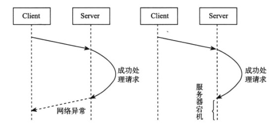
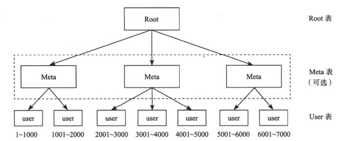
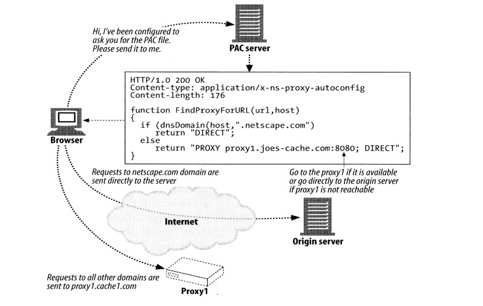
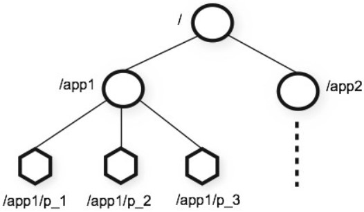
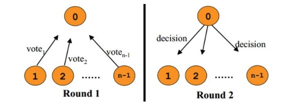
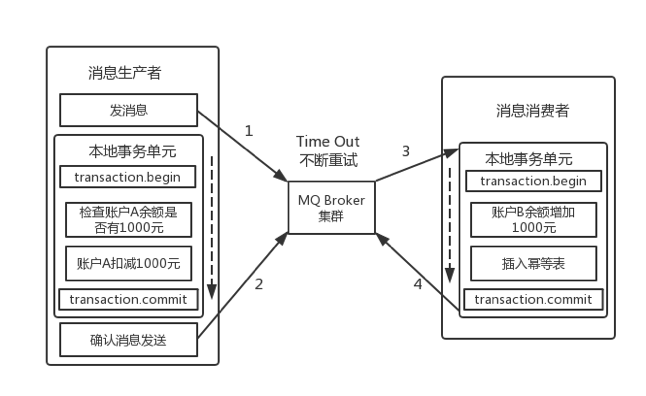
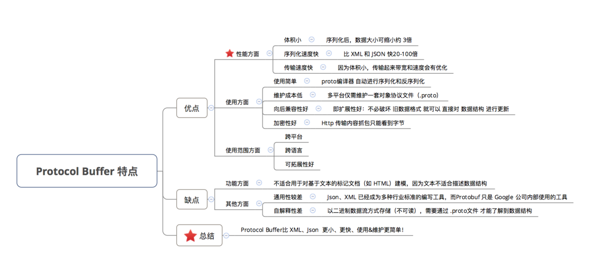
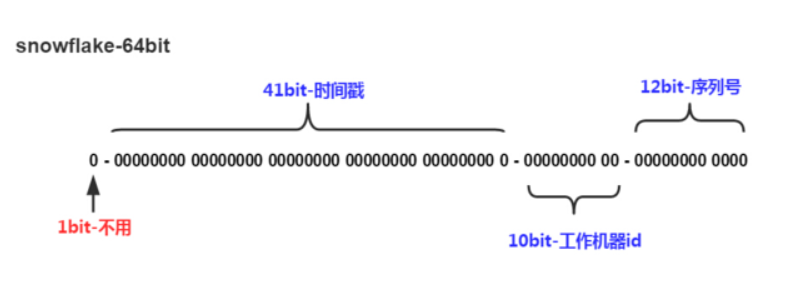
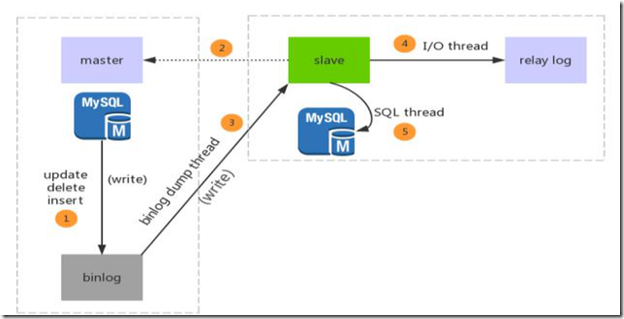

# 分布式基础

## 1. 概述

### 1.1 基础概念

**中间件**

分布式系统可以把服务垂直分成三层：应用服务层，中间件，平台层。中间件是一个软件层，下接平台层就要求中间件有很好的异构性，能适应各种操作系统。

中间件遵循分布式体系结构模型的分类可以分五种：分布式对象，分布式组建，发布-订阅系统，消息队列和 Web 服务。

**异常**

- 服务器宕机：内存错误、服务器停电等都会导致服务器宕机，此时节点无法正常工作，称为不可用。

  服务器宕机会导致节点失去所有内存信息，因此需要将内存信息保存到持久化介质上。

- 网络异常：有一种特殊的网络异常称为  **网络分区** ，即集群的所有节点被划分为多个区域，每个区域内部可以通信，但是区域之间无法通信。

- 磁盘故障：磁盘故障是一种发生概率很高的异常。可以使用使用冗余机制，将数据存储到多台服务器。

**超时**

在分布式系统中，一个请求除了成功和失败两种状态，还存在着超时状态。



可以将服务器的操作设计为具有  **幂等性** ，即执行多次的结果与执行一次的结果相同。如果使用这种方式，当出现超时的时候，可以不断地重新请求直到成功。

### 1.2 分布式的应用场景

分布式主要是为了提供可扩展性以及高可用性，业务中使用分布式的场景主要有**分布式存储**以及**分布式计算**。

分布式存储中可以将数据分片到多个节点上，不仅可以提高性能（可扩展性），同时也可以使用多个节点对同一份数据进行备份（高可用性）。

至于分布式计算，就是将一个大的计算任务分解成小任务分配到多个节点上去执行，再汇总每个小任务的执行结果得到最终结果。MapReduce 是分布式计算最好的例子。

### 1.3 分布式系统的衡量指标

**性能**

- 吞吐量：系统在某一段时间可以处理的请求总数，通常为每秒的读操作数或者写操作数
- 响应时间：从某个请求发出到接收到返回结果消耗的时间

无并发的系统中，吞吐量与响应时间成反比。

并发系统中，请求可以在等待IO时让出CPU的资源。所以CPU利用率会增加，吞吐量也会增加。但是，每个请求的响应时间可能会延长，因为请求不能马上被处理，需要和其它请求一起进行并发处理。

**可用性**

可用性指系统在面对各种异常时可以提供正常服务的能力。可以用系统可用时间占总时间的比值来衡量，4 个 9 的可用性表示系统 99.99% 的时间是可用的。

**一致性**

- 强一致性：新数据写入之后，在任何数据副本上都能读取到最新值；
- 弱一致性：新数据写入之后，不能保证在数据副本上能读取到最新值；
- 最终一致性：新数据写入之后，只能保证过了一个时间窗口后才能在数据副本上读取到最新值；

**可扩展性**

指系统通过扩展集群服务器规模来提高性能的能力。理想的分布式系统需要实现“线性可扩展”，即随着集群规模的增加，系统的整体性能也会线性增加。

### 1.4 基本原则与设计理念

#### 1.4.1 CAP

CAP理论是指分布式系统设计中一致性（Consistency）、可用性（Availability ）和分区容错性（Partition Tolerance）最多满足两个。

- 一致性：读各分布式结点的数据结果一致。
- 可用性：每一请求操作都能在一定时间内返回结果。
- 分区容忍性：当网络发生分区时是否能够容忍，也可以说网络发生分区（包括消息丢失）时，整个系统能否正常提供服务。

**三者无法兼得**

假设一个系统同时满足一致性和可用性时，如果网络发生了分区，那么对于一个插入操作来说，插入结点必须要把插入消息传递给其他结点来保证一致性，而网络分区时，必然有一些结点无法收到消息，无法完成一致性；那么如果此时放弃插入操作，一致性可以满足，但是插入操作的可用性得不到满足。所以CAP三者不能兼得。

**三选二**

由于网络总是不可靠的，所以 P 必不可少。所以实际设计分布式系统需要在一致性和可用性之间做权衡。

CP分布式系统：当网络分区发生时，保证一致性，放弃可用性。如放弃网络分区发生时的写操作。

AP分布式系统：当网络分区发生时，保证可用性，即保证所有操作在一定时间内都返回。如网络分区时，结点先写入自己就认为写入成功返回，然后再通过消息传递等通知其他结点，直到通知成功。

#### 1.4.2 BASE

BASE 是 Basically Available（基本可用）、Soft State（软状态）和 Eventually Consistent（最终一致性）三个短语的缩写。BASE 理论是对 CAP 中一致性和可用性权衡的结果，是基于 CAP 定理逐步演化而来的。BASE 理论的核心思想是：保证基本可用，即使无法做到强一致性，但每个应用都可以根据自身业务特点，采用适当的方式来使系统达到最终一致性。

- 基本可用：指分布式系统在出现故障的时候，保证核心可用，允许损失部分可用性。
- 软状态：指允许系统存在中间状态，而该中间状态不会影响系统整体可用性，即不同节点的数据副本之间进行同步的过程允许存在延时。
- 最终一致性：指所有的数据副本，在经过一段时间的同步之后，最终都能够达到一致的状态。

ACID 是传统数据库系统常用的设计理论，追求强一致性模型。BASE 常用于大型分布式系统，只需要保证最终一致性。在实际的分布式场景中，不同业务单元和组件对一致性的要求是不同的，因此 ACID 和 BASE 往往会结合在一起使用。

#### 1.4.3 幂等性 Idempotent

重复操作结果相同。

### 1.5 数据分片

分布式系统的数据分布在多个节点中，常用的数据分布方式有哈希分片和范围分片。

#### 1.5.1 哈希分片

哈希分片就是将数据计算哈希值之后，按照哈希值分配到不同的节点上。例如有 N 个节点，数据的主键为 key，则将该数据分配的节点序号为：hash(key)%N。

传统的哈希分片算法存在一个问题：当节点数量变化时，也就是 N 值变化，那么几乎所有的数据都需要重新分布，将导致大量的数据迁移。

**一致性哈希（Distributed Hash Table）**

对于哈希空间  [0, 2^n-1]，将该哈希空间看成一个哈希环，将每个节点都配置到哈希环上。每个数据对象通过哈希取模得到哈希值之后，存放到哈希环中顺时针方向第一个大于等于该哈希值的节点上。

一致性哈希的优点是在增加或者删除节点时只会影响到哈希环中相邻的节点。如删除一个结点，只需要把该节点的所有数据放到下一个顺时针结点即可。若增加一个节点，只需要对下一个顺时针结点的数据重新哈希。

#### 1.5.2 范围分片

哈希分片式破坏了数据的有序性，范围分片则不会。

范围分片的数据划分为多个连续的部分，按一定策略分布到不同节点上。例如下图中，User 表的主键范围为 1 \~ 7000，使用范围分片可以将其划分成多个子表，对应的主键范围为 1 \~ 1000，1001 \~ 2000，...，6001 \~ 7000。



引入 Meta 表是为了支持更大的集群规模，它将原来的一层索引结分成两层，Meta 维护着 User 子表所在的节点，从而减轻 Root 节点的负担。

## 2. 数据复制与一致性

### 2.1一致性模型分类

**强一致性**

或称为严格一致性，要求新数据写入之后，在任何数据副本上都能读取到最新值；

**顺序一致性**

一系列操作在多个结点上执行结果都相同，就好像存在某个确定的执行顺序一样，并且所有结点看到的执行顺序都相同。

**因果一致性**

保证所有操作有序的代价比较大，只需要保证那些具有因果关系的操作顺序（必须P操作写的值依赖Q操作）即可。也就是说，所有结点看到具有因果关系的操作顺序是相同的。

**最终一致性**

新数据写入之后，只能保证过了一个时间窗口后才能在数据副本上读取到最新值；

**会话一致性**

在分布式场景下，一个用户的 Session 如果只存储在一个服务器上，那么当负载均衡器把用户的下一个请求转发到另一个服务器上，该服务器没有用户的 Session，就可能导致用户需要重新进行登录等操作。因此需要保证这些会话的一致性。

解决方案有，

1. 通过在负载均衡和客户端之间设立一个共同的Session服务器。缺点，Session服务器不能宕机。
2. 所有服务器Session同步。缺点，需要同步开销。
3. Session 持久化存入数据库，可以使用内存数据库如Redis。

**单调读一致性**

如果一个进程，读操作读到一个值，那么该进程后面的读操作不能读到比这个值更旧的值。

**单调写一致性**

一个进程对一个数据的写操作必须在对这个数据的后续写操作完成之前完成。

### 2.2 副本更新策略

**同时更新**

**主从更新**

**任意节点更新**

### 2.3 一致性协议

#### 2.3.1 向量时钟

向量时钟是一个记录了当前结点已读到各结点的版本的记录值。每个结点的每个值都存有一个向量时钟。

**向量时钟的偏序**

如果一个向量时钟的所有版本记录值均大于等于或小于等于则称向量时钟存在偏序关系。

**向量时钟工作过程**

- 每个结点更新一个值时，会把自己的向量时钟中自己对应位置的向量值加d（一般为1），然后把更新值连同向量时钟发给其他结点进行同步。
- 其他结点再接到更新消息时，会先对传来的向量时钟Vin和自己向量V时钟进行比较。
  - 如果Vin和V存在偏序关系，且 Vin 小于 V，说明 V 数据更新一点，所以会丢弃当前更新
  - 如果Vin和V存在偏序关系，且Vin 大于 V，则当前结点更新值，并把时钟向量设为Vin
  - 否则就是发生了冲突，向量时钟不处理冲突，只传回客户端发生冲突的消息。

如，3个结点 A、B、C 使用向量时钟来同步 x 的过程如下：

```
# 初始都为0
A: {x:0, vs:[0,0,0]}
B: {x:0, vs:[0,0,0]}
C: {x:0, vs:[0,0,0]}

# A更新x为1,并发送更新消息给BC
A: {x:1, vs:[1,0,0]}
B: {x:1, vs:[1,0,0]}
C: {x:1, vs:[1,0,0]}

# C更新x为5,并发送更新消息给AB，但A丢失了消息
A: {x:1, vs:[1,0,0]}
B: {x:5, vs:[1,0,1]}
C: {x:5, vs:[1,0,1]}

# A更新x为2，并发送更新消息给BC
A: {x:2, vs:[2,0,0]}
B: {x:5, vs:[1,0,1]} # [2,0,0]与[1,0,1]不存在偏序关系，发送了冲突
C: {x:5, vs:[1,0,1]} # [2,0,0]与[1,0,1]不存在偏序关系，发送了冲突
```

**向量时钟的问题**

空间无限增长问题，有几个结点就需要相应长度的向量。所以只对服务器记录向量长度会比较可控。

#### 2.3.2 RWN 协议（法定人数）

RWN可以保证强一致性。

RWN指的是每次读操作需要读取R个结点，每次写操作需要写到W个结点，总共N个结点，只需保证R + W > N就可保证读取的强一致性，因为这样可以保证读取时至少可以读取到一个最新的值。

#### 2.3.3 Paxos 协议

用于达成共识性问题，即对多个节点产生的值，该算法能保证只选出唯一一个值。

主要有三类节点：

- 提议者（Proposer）：向所有接收者发送提议请求；当接收到过半数的响应时，向接收者发送相应中最新的接受请求。
- 接受者（Acceptor）：对每个新的提议进行相应，并承若不在接收更旧的提议；当受到接收请求时，若接受请求大于等于承诺的提议序号，则发送一个通知给告知者。
- 告知者（Learner）：告知者收到过半的通知时，选择当前值为决定值。

**两阶段决定**

第一阶段：提议者获得一个过半数的提议相应

第二阶段：提议这个选取最大的响应序号，发起接收请求，当有半数以上同意接收时产生决定值，否则，重复第一阶段

**约束条件**

1）正确性

指只有一个提议值会生效。因为 Paxos 协议要求每个生效的提议被多数 Acceptor 接收，并且 Acceptor 不会接受两个不同的提议，因此可以保证正确性。

2） 可终止性

指最后总会有一个提议生效。Paxos 协议能够让 Proposer 发送的提议朝着能被大多数 Acceptor 接受的那个提议靠拢，因此能够保证可终止性。

#### 2.3.4 Raft 协议

Raft 和 Paxos 类似，但是更容易理解，也更容易实现。Raft 主要是用来竞选主节点。

有三种节点：Follower、Candidate 和 Leader。Leader 会周期性的发送心跳包给 Follower。每个 Follower 都设置了一个随机的竞选超时时间，一般为 150ms\~300ms，如果在这个时间内没有收到 Leader 的心跳包，就会变成 Candidate，进入竞选阶段。

**Leader选举过程**

- 最初阶段：此时只有 Follower，没有 Leader，超时较短的结点会成为 Candidate 。

- 竞选阶段：Candidate 发送投票请求给其它所有节点。其它节点会对请求进行回复，如果超过一半的节点回复了，那么该 Candidate 就会变成 Leader。之后 Leader 会周期性地发送心跳包给 Follower，Follower 接收到心跳包，会重新开始计时。

  如果是多个 Candidate 竞选，则选择 Candidate 的票最多的结点，若存在多个相同最多票数的结点，则重新开始选举。

**Leader日志复制**

1. 来自客户端的修改都会被传入 Leader。注意该修改还未被提交，只是写入日志中。
2. Leader 会把修改复制到所有 Follower。接收到的 Follower 也进行了修改。该修改也未提交。
3. Leader 等待大多数 Follower 完成了修改，然后提交，并通知的所有 Follower 让它们也提交修改，此时所有节点的值达成一致。

#### 2.3.5 拜占庭将军问题

**问题描述**

拜占庭将军问题可以非正式的表述为：3个或更多的将军协商共同进攻还是共同撤退的问题。当一个将军发布命令时他可以看作是司令，其他将军可以看作是中尉。即司令发布命令，中尉之间传递命令。将军之中存在叛徒，叛徒会给其他将军发送错误或干扰命令。那么忠诚的将军之间如何达成一致呢？（假定相互之间无法识别哪个将军叛变。而且，已经证明了通过消息传递在不可靠信道上达成一致是不可能的，所以假设信道也是没有问题的）

**可能解条件**

一个结论就是 N >= 3m + 1，意为当存在 m 个叛徒时，若总的将军数大于等于 3m + 1，那么它们之间就能达成一致。

**OM(m) 算法**

首先定义 majority 函数：假设一个将军收到其他 n - 1 个将军的命令分别为 (v1,v2,...,vn-1)，那么majority(v1,v2,...,vn-1) 的值为 (v1,v2,...,vn-1) 的众数。

算法步骤（有待修正）：

1. 司令发送命令给他的 n - 1 个中尉
2. 对于任意i，vi 代表中尉 i 从司令收到的命令，如果没有收到使用 RETREAT。中尉 i 将收到的命令传递给其他中尉。
3. 现在所有的中尉都收到了其他 n - 1个将军的命令，没有收到的使用 RETREAT，每个中尉使用majority(v1,v2,...,vn-1)作为决定值。

## 3. 负载均衡

衡量负载的因素很多，如 CPU、内存、磁盘等资源使用情况、读写请求数等。分布式系统应当能够自动负载均衡，当某个节点的负载较高，将它的部分数据迁移到其它节点。

每个集群都有一个总控节点，其它节点为工作节点，由总控节点根据全局负载信息进行整体调度，工作节点定时发送心跳包（Heartbeat）将节点负载相关的信息发送给总控节点。

一个新上线的工作节点，由于其负载较低，如果不加控制，总控节点会将大量数据同时迁移到该节点上，造成该节点一段时间内无法工作。因此负载均衡操作需要平滑进行，新加入的节点需要较长的一段时间来达到比较均衡的状态。

### 3.1 算法

**轮询/随机**

把每个请求轮流。随机发送到每个服务器上。 该算法比较适合每个服务器的性能差不多的场景，如果有性能存在差异的情况下，那么性能较差的服务器可能无法承担多大的负载。

**加权轮询**

加权轮询是在轮询的基础上，根据服务器的性能差异，为服务器赋予一定的权值。 

由于每个请求的连接时间不一样，使用轮询或者加权轮询算法的话，可能会让一台服务器当前连接数多大，而另一台服务器的连接多小，造成负载不均衡。 

**最少连接**

将请求发送给当前最少连接数的服务器上。

**加权最少连接**

在最小连接的基础上，根据服务器的性能为每台服务器分配权重，再根据权重计算出每台服务器能处理的连接数。 

**源地址哈希**

源地址哈希通过对客户端 IP 哈希计算得到的一个数值，用该数值对服务器数量进行取模运算，取模结果便是目标服务器的序号。

- 优点：保证同一 IP 的客户端都会被 hash 到同一台服务器上。
- 缺点：不利于集群扩展，后台服务器数量变更都会影响 hash 结果。可以采用一致性 Hash 改进。

### 3.2 实现

**HTTP重定向**

HTTP 重定向负载均衡服务器收到 HTTP 请求之后会返回服务器的地址，并将该地址写入 HTTP 重定向响应中返回给浏览器，浏览器收到后需要再次发送请求。

缺点：

- 用户访问的延迟会增加；
- 如果负载均衡器宕机，就无法访问该站点

**DNS重定向**

使用 DNS 作为负载均衡器，根据负载情况返回不同服务器的 IP 地址。大型网站基本使用了这种方式做为第一级负载均衡手段，然后在内部使用其它方式做第二级负载均衡。

缺点：

- DNS 查找表可能会被客户端缓存起来，那么之后的所有请求都会被重定向到同一个服务器。

**修改MAC地址**

使用 LVS（Linux Virtual Server）这种链路层负载均衡器，根据负载情况修改请求的 MAC 地址。 

**修改IP地址**

在网络层修改请求的目的 IP 地址。 

**代理自动配置**

正向代理与反向代理的区别：

- 正向代理：发生在客户端，是由用户主动发起的。比如翻墙，客户端通过主动访问代理服务器，让代理服务器获得需要的外网数据，然后转发回客户端。
- 反向代理：发生在服务器端，用户不知道代理的存在。

下面是PAC 服务器是用来判断一个请求是否要经过代理的过程。 


 


## 4. 分布式锁和事物

### 4.1 分布式锁

**使用场景**

在服务器端使用分布式部署的情况下，一个服务可能分布在不同的节点上，比如订单服务分布在节点 A 和节点 B 上。如果多个客户端同时对一个服务进行请求时，就需要使用分布式锁。例如一个服务可以使用 APP 端或者 Web 端进行访问，如果一个用户同时使用 APP 端和 Web 端访问该服务，并且 APP 端的请求路由到了节点 A，WEB 端的请求被路由到了节点 B，这时候就需要使用分布式锁来进行同步。

**常见解决方案**

分布式锁一般有三种实现方式：1. 数据库乐观锁；2. 基于Redis的分布式锁；3. 基于ZooKeeper的分布式锁 。

#### 4.1.1 数据库分布式锁

**（一）基于 MySQL 锁表**

该实现完全依靠数据库的唯一索引。当想要获得锁时，就向数据库中插入一条记录，释放锁时就删除这条记录。如果记录具有唯一索引，就不会同时插入同一条记录。

如下创建一张这样的表

```sql
CREATE TABLE 'method_lock'(
	`ID` int(11) NOT NULL AUTO_INCREMENT;
    `method_name` varchar(64) NOT NULL DEFAULT '';
    PRIMARY KEY(ID),
  	UNIQUE KEY `uniq_method_name`(`method_name`) USING BTREE  
);
```

利用 method_name 的唯一索引就可以保证方法同时只有一个在执行。

这种方式存在以下几个问题：

1. 强依赖数据库
2. 锁没有失效时间，解锁失败会导致死锁，其他线程无法再获得锁。可以通过增加失效时间解决。当还需要锁时可以延长失效时间。
3. 只能是非阻塞锁，插入失败直接就报错了，无法重试。
4. 不可重入，同一线程在没有释放锁之前无法再获得锁。

**（二）采用乐观锁增加版本号**

根据版本号来判断更新之前有没有其他线程更新过，如果被更新过，则获取锁失败。

#### 4.1.2 Redis 分布式锁

**（一）基于 SETNX、EXPIRE**

使用 SETNX（set if not exist）命令插入一个键值对时，键为需要加锁的方法，值为锁的持有者，如果 Key 已经存在，那么会返回 False，否则插入成功并返回 True。因此客户端在尝试获得锁时，先使用 SETNX 向 Redis 中插入一个记录，如果返回 True 表示获得锁，返回 False 表示已经有客户端占用锁。

EXPIRE 可以为一个键值对设置一个过期时间，从而避免了死锁的发生。

**（二）RedLock 算法**

RedLock 算法使用了多个 Redis 实例来实现分布式锁，这是为了保证在发生单点故障时还可用。

1. 尝试从 N 个相互独立 Redis 实例获取锁，如果一个实例不可用，应该尽快尝试下一个。
2. 计算获取锁消耗的时间，只有当这个时间小于锁的过期时间，并且从大多数（N/2+1）实例上获取了锁，那么就认为锁获取成功了。
3. 如果锁获取失败，会到每个实例上释放锁。然后随机时间后重试。

#### 4.1.3 Zookeeper 分布式锁

Zookeeper 是一个为分布式应用提供一致性服务的软件，例如配置管理、分布式协同以及命名的中心化等，这些都是分布式系统中非常底层而且是必不可少的基本功能，但是如果自己实现这些功能而且要达到高吞吐、低延迟同时还要保持一致性和可用性，实际上非常困难。

**（一）抽象模型**

Zookeeper 提供了一种树形结构级的命名空间，/app1/p_1 节点表示它的父节点为 /app1。

[](https://github.com/jerehao/Interview-Notebook/blob/master/pics/31d99967-1171-448e-8531-bccf5c14cffe.jpg)

 

**（二）节点类型**

- 永久节点：不会因为会话结束或者超时而消失；
- 临时节点：如果会话结束或者超时就会消失；
- 有序节点：会在节点名的后面加一个数字后缀，并且是有序的，例如生成的有序节点为 /lock/node-0000000000，它的下一个有序节点则为 /lock/node-0000000001，依次类推。

**（三）监听器**

为一个节点注册监听器，在节点状态发生改变时，会给客户端发送消息。

**（四）分布式锁实现**

1. 创建一个锁目录 /lock。
2. 在 /lock 下创建临时的且有序的子节点，第一个客户端对应的子节点为 /lock/lock-0000000000，第二个为 /lock/lock-0000000001，以此类推。
3. 客户端获取 /lock 下的子节点列表，判断自己创建的子节点是否为当前子节点列表中序号最小的子节点，如果是则认为获得锁，否则监听自己的前一个子节点，获得子节点的变更通知后重复此步骤直至获得锁；
4. 执行业务代码，完成后，删除对应的子节点。

**（五）会话超时**

如果一个已经获得锁的会话超时了，因为创建的是临时节点，因此该会话对应的临时节点会被删除，其它会话就可以获得锁了。可以看到，Zookeeper 分布式锁不会出现数据库分布式锁的死锁问题。

**（六）羊群效应**

在步骤二，一个节点未获得锁，需要监听监听自己的前一个子节点，这是因为如果监听所有的子节点，那么任意一个子节点状态改变，其它所有子节点都会收到通知（羊群效应），而我们只希望它的后一个子节点收到通知。

**（七）小结**

使用Zookeeper实现分布式锁的优点

有效的解决单点问题，不可重入问题，非阻塞问题以及锁无法释放的问题。实现起来较为简单。

使用Zookeeper实现分布式锁的缺点

性能上不如使用缓存实现分布式锁。 需要对ZK的原理有所了解。

**（八）三种分布式锁方案的比较**

从理解的难易程度角度（从低到高）：数据库 > 缓存 > Zookeeper

从实现的复杂性角度（从低到高）：Zookeeper >= 缓存 > 数据库

从性能角度（从高到低）：缓存 > Zookeeper >= 数据库

从可靠性角度（从高到低）：Zookeeper > 缓存 > 数据库

### 4.2 分布式事物

#### 4.2.1 两阶段提交

Two-phase Commit（2PC），可以保证一个事务跨越多个节点时保持 ACID 特性。

两类节点：协调者（Coordinator）和参与者（Participants），协调者只有一个，参与者可以有多个。

**运行过程**

- 准备阶段：协调者询问参与者事务是否执行成功；
- 提交阶段：等到询问返回后。如果事务在每个参与者上都执行成功，协调者发送通知让参与者提交事务；否则，协调者发送通知让参与者回滚事务。

**存在的问题**

- 参与者发生故障。解决方案：可以给事务设置一个超时时间，如果某个参与者一直不响应，那么认为事务执行失败。
- 协调者发生故障。解决方案：将操作日志同步到备用协调者，让备用协调者接替后续工作。
- 实现复杂，牺牲了可用性，对性能影响较大，不适合高并发高性能场景 

#### 4.2.2 TCC补偿事务

TCC 其实就是采用的补偿机制，其核心思想是：针对每个操作，都要注册一个与其对应的确认和补偿（撤销）操作。它分为三个阶段：

- Try 阶段：主要是对业务系统做检测及资源预留
- Confirm 阶段：主要是对业务系统做确认提交，Try阶段执行成功并开始执行 Confirm阶段时，默认 Confirm阶段是不会出错的。即：只要Try成功，Confirm一定成功。
- Cancel 阶段：主要是在业务执行错误，需要回滚的状态下执行的业务取消，预留资源释放。

举个例子，假入 Bob 要向 Smith 转账，思路大概是： 我们有一个本地方法，里面依次调用 1、首先在 Try 阶段，要先调用远程接口把 Smith 和 Bob 的钱给冻结起来。 2、在 Confirm 阶段，执行远程调用的转账的操作，转账成功进行解冻。 3、如果第2步执行成功，那么转账成功，如果第二步执行失败，则调用远程冻结接口对应的解冻方法 (Cancel)。 

**缺点**：所以需要程序员在实现的时候多写很多补偿的代码，在一些场景中，一些业务流程可能用TCC不太好定义及处理。 

#### 4.2.3 本地消息表

 

核心思想是将分布式事务拆分成本地事务进行处理。基本思路就是：

消息生产方，需要额外建一个消息表，并记录消息发送状态。消息表和业务数据要在一个事务里提交，也就是说他们要在一个数据库里面。然后消息会经过MQ发送到消息的消费方。如果消息发送失败，会进行重试发送。

消息消费方，需要处理这个消息，并完成自己的业务逻辑。此时如果本地事务处理成功，表明已经处理成功了，如果处理失败，那么就会重试执行。如果是业务上面的失败，可以给生产方发送一个业务补偿消息，通知生产方进行回滚等操作。

处理收到的消息通常采用两种方式：

1. 采用时效性高的MQ，由对方订阅消息并监听，有消息时自动触发事件
2. 采用定时轮询扫描的方式，去检查消息表的数据。

两种方式其实各有利弊，仅仅依靠MQ，可能会出现通知失败的问题。而过于频繁的定时轮询，效率也不是最佳的（90%是无用功）。所以，我们一般会把两种方式结合起来使用。

**缺点**：关系型数据库的吞吐量和性能方面存在瓶颈，频繁的读写消息会给数据库造成压力。所以，在真正的高并发场景下，该方案也会有瓶颈和限制的。 

#### 4.2.4 MQ事物消息

有一些第三方的MQ是支持事务消息的，比如RocketMQ，他们支持事务消息的方式也是类似于采用的二阶段提交，但是市面上一些主流的MQ都是不支持事务消息的，比如 RabbitMQ 和 Kafka 都不支持。

**不支持事物的MQ**

消息生产者操作：

1. 本地事物运行
2. 1 步骤成功后，向MQ投递消息，若投递失败则回滚事物

消息消费者操作：

1. 接收消息并执行本地事物
2. 1失败后，幂等重试

**支持事物的MQ**

Apache开源的RocketMQ中间件能够支持的事务消息机制，确保本地操作和发送消息的异步处理达到本地事务的结果一致。

第一阶段，RocketMQ在执行本地事务之前，会先发送一个Prepared消息，并且会持有这个消息的接口回查地址。

第二阶段，执行本地事物操作。

第三阶段，确认消息发送，通过第一阶段拿到的接口地址URL执行回查，并修改状态，如果本地事务成功，则修改状态为已提交，否则修改状态为已回滚（消费也通过查询此状态提交或回滚）。

[](http://www.importnew.com/26212.html/picture1)

其中，如果第三阶段的确认消息发送失败后，RocketMQ会有定时任务扫描集群中的事务消息，如果发现还是处于prepare状态的消息，它会向消息发送者确认本地事务是否已执行成功。RocketMQ会根据发送端设置的策略来决定是回滚还是继续发送确认消息。这样就保证了消息的发送与本地事务同时成功或同时失败。 

## 5. 分布式通信

### 5.1 序列化

在 java 中可以将一个对象和一组关联的对象序列化成串行的字节序列，这个打平后的字节序列可以存储在磁盘上或进行远程传送。反序列化可以从这个串行的字节序列恢复对象或一组对象到内存中。序列化的字节序列中包含了类的一些信息，指导反序列时需要加载的类，这个类的信息由类名和版本号（serialVersionUID ）组成，当类有较大改动时应当变更版本号。当反序列化时可以发现检测到版本不一致。

当序列化一个对象时，其内部的关联的对象也会一起序列化（可以通过关键字 transient 标记不需要序列化的对象）。序列化会按一定的顺序写入所需要的所有类（重复类也只记录一次）的信息，变量个数，所有变量信息及对象句柄。使用 `ObjectOutputStream.writeObject()`完成序列化。

当反序列化一个对象时，会先加载需要的类，然后恢复变量，恢复引用变量时会检查引用的句柄是否已经被实例化，保证一次反序列化过程中同一引用变量只被实例化一次。序列后获取的对象可以通过 `getClass()` 等方法获取具体的类。使用 `ObjectInputStream.readObject()`完成反序列化。

### 5.2 远程过程调用（RPC）

按字面意义，远程过程调用就是调用远程服务上的一个服务方法，而远程调用显然是涉及到数据通信的复杂调用。如果能把这个通信过程封装起来，像调用本地服务一样调用远程服务，这个封装好的服务就称为远程过程调用。

下图描述了一个远程服务调用的全过程：

 

1. 服务消费方（client）调用以本地调用方式调用服务；
2. client stub接收到调用后负责将方法、参数等组装成能够进行网络传输的消息体；
3. client stub找到服务地址，并将消息发送到服务端；
4. server stub收到消息后进行解码；
5. server stub根据解码结果调用本地的服务；
6. 本地服务执行并将结果返回给server stub；
7. server stub将返回结果打包成消息并发送至消费方；
8. client stub接收到消息，并进行解码；
9. 服务消费方得到最终结果。

RPC的目标就是要2~8这些步骤都封装起来，让用户对这些细节透明。 

Java 透明性可以用代理实现，使用代理类实现远程通信的过程，然后用代理类封装要被代理类。通信的过程要传输调用的服务名（如接口名和方法名）以及参数，可以用序列化或其他格式化形式的数据传送。

### 5.3 ProtocolBuffer 与 Thrift

**（一）Protocol Buffer** 

Protocol Buffer 其实是 Google 出品的一种轻量 & 高效的结构化数据存储格式，性能比 Json、XML 强很多。

Protocol Buffer 有两个明显的优点：

1. 序列化速度 & 反序列化速度快  
2. 数据压缩效果好，即序列化后的数据量体积小 

Protocol Buffer 通过将结构化的数据进行串行化（**序列化**），从而实现 **数据存储 / RPC 数据交换**的功能。

 

**T - L - V 的数据存储方式**

即 Tag - Length - Value，标识 - 长度 - 字段值 存储方式。

以 标识 - 长度 - 字段值 表示单个数据，最终将所有数据拼接成一个 字节流，从而 实现 数据存储 的功能

其中 Length可选存储，如 储存Varint编码数据就不需要存储Length

优点： 

* 不需要分隔符就能分隔开字段，减少了分隔符的使用，各字段 存储得非常紧凑，存储空间利用率非常高
* 若字段没有被设置字段值，那么该字段在序列化时的数据中是完全不存在的，即不需要编码（相应字段在解码时才会被设置为默认值）

**Varint 编码方式**

一种变长的编码方式，用字节 表示 数字：**值越小的数字，使用越少的字节数表示** 。通过减少表示数字的字节数 从而进行数据压缩 。

原理：利用每个字节的最高位标记特殊含义，最高为1表示下个字节也是该数字的一部分，如果是0表示当前字节是最后一个字节。剩下的七位表示数组。

不足：当小负数使用 Varint 存储时，会占有比较长的字节。 为了更好地减少表示负数，Protocol Buffer 在 Varint编码上又增加了 Zigzag 编码方式进行编码。

**Zigzag 编码方式**

使用无符号数来表示有符号数字 ，使得绝对值小的数字都可以采用较少字节来表示 。

原理：(n <<1) ^ (n >>31)  ，相当于把符号位移到最低位，且对其他位按位取反。

**总述**

Protocol Buffer 的序列化 & 反序列化简单 & 速度快的原因是： 

1. 编码 / 解码 方式简单（只需要简单的数学运算 = 位移等等） 
2.  采用 **Protocol Buffer 自身的框架代码 和 编译器** 共同完成

Protocol Buffer 的数据压缩效果好（即序列化后的数据量体积小）的原因是： 

1. 采用了独特的编码方式，如`Varint`、`Zigzag`编码方式等等 
2. 采用 `T - L - V` 的数据存储方式：减少了分隔符的使用 & 数据存储得紧凑

**（二）Thrift**

Apahce Thrift 是 FaceBook 实现的一种高效的、支持多种语言的远程服务调用的框架。自己实现了序列化等操作。 

### 5.4 Avro

Avro是一个数据序列化系统，设计用于支持大批量数据交换的应用。

它的主要特点有：支持二进制序列化方式，可以便捷，快速地处理大量数据；动态语言友好，Avro 提供的机制使动态语言可以方便地处理 Avro 数据。

当前市场上有很多类似的序列化系统，如 Google 的 Protocol Buffers, Facebook 的 Thrift。这些系统反响良好，完全可以满足普通应用的需求。针对重复开发的疑惑，Doug Cutting 撰文解释道：Hadoop 现存的 RPC 系统遇到一些问题，如性能瓶颈(当前采用 IPC 系统，它使用 Java 自带的 DataOutputStream 和DataInputStream )；需要服务器端和客户端必须运行相同版本的 Hadoop；只能使用 Java 开发等。但现存的这些序列化系统自身也有毛病，以 Protocol Buffers 为例，它需要用户先定义数据结构，然后根据这个数据结构生成代码，再组装数据。如果需要操作多个数据源的数据集，那么需要定义多套数据结构并重复执行多次上面的流程，这样就不能对任意数据集做统一处理。其次，对于 Hadoop 中 Hive 和 Pig 这样的脚本系统来说，使用代码生成是不合理的。并且Protocol Buffers 在序列化时考虑到数据定义与数据可能不完全匹配，在数据中添加注解，这会让数据变得庞大并拖慢处理速度。其它序列化系统有如 Protocol Buffers 类似的问题。所以为了Hadoop的前途考虑，Doug Cutting主导开发一套全新的序列化系统，这就是 Avro，于09年加入Hadoop项目族中。

 Avro依赖模式(Schema)来实现数据结构定义。可以把模式理解为Java的类，它定义每个实例的结构，可以包含哪些属性。可以根据类来产生任意多个实例对象。对实例序列化操作时必须需要知道它的基本结构，也就需要参考类的信息。这里，根据模式产生的Avro对象类似于类的实例对象。每次序列化/反序列化时都需要知道模式的具体结构。所以，在Avro可用的一些场景下，如文件存储或是网络通信，都需要模式与数据同时存在。Avro数据以模式来读和写(文件或是网络)，并且写入的数据都不需要加入其它标识，这样序列化时速度快且结果内容少。由于程序可以直接根据模式来处理数据，所以Avro更适合于脚本语言的发挥。

Avro的模式主要由JSON对象来表示，它可能会有一些特定的属性，用来描述某种类型(Type)的不同形式。Avro支持八种基本类型(Primitive Type)和六种混合类型(Complex Type)。基本类型可以由JSON字符串来表示。每种不同的混合类型有不同的属性(Attribute)来定义，有些属性是必须的，有些是可选的，如果需要的话，可以用JSON数组来存放多个JSON对象定义。在这几种Avro定义的类型的支持下，可以由用户来创造出丰富的数据结构来，支持用户纷繁复杂的数据。

### 5.5 消息队列 kafka等

参见 Kafka，RocketMQ 文档。

### 5.6 应用层多播

## 6. 分布式存储

### 6.1分布式文件系统

### 6.2 分布式数据库

## 7. 分布式计算

见 Hadoop 的MapReduce

## 8. 常见问题

### 8.1 分布式数据库的ID生成策略

**UUID**

优点：全球唯一；生成快速

缺点：生成无序，不能趋势递增；字符串存储，需要的空间大

**Snowflake 算法（Twitter）**

 

优点：快；趋势递增；实现简单

缺点：依赖机器时间，如果发生回拨会导致可能生成id重复。 

回拨问题解决：

1. 集中生成，然后需要的结点每次取一批回来，即也相当于消息队列下发
2. 等待时间追回在生成id

### 8.2 MySQL 的主从复制原理

主从复制，是用来建立一个和主数据库完全一样的数据库环境，称为从数据库；主数据库一般是准实时的业务数据库。 

**主从复制的好处**

1. 做数据的热备，作为后备数据库，主数据库服务器故障后，可切换到从数据库继续工作，避免数据丢失。
2. 架构的扩展。业务量越来越大，I/O访问频率过高，单机无法满足，此时做多库的存储，降低磁盘I/O访问的频率，提高单个机器的I/O性能。
3. 读写分离，使数据库能支撑更大的并发。在报表中尤其重要。由于部分报表sql语句非常的慢，导致锁表，影响前台服务。如果前台使用master，报表使用slave，那么报表sql将不会造成前台锁，保证了前台速度。

**主从复制的原理**

数据库有个bin-log二进制文件，记录了所有sql语句。我们的目标就是把主数据库的bin-log文件的sql语句复制过来。让其在从数据的relay-log重做日志文件中再执行一次这些sql语句即可。

具体步骤：

1. 主库db的更新事件(update、insert、delete)被写到binlog
2. 从库发起连接，连接到主库，此时主库创建一个binlog dump thread线程，把binlog的内容发送到从库
3. 从库启动之后，创建一个I/O线程，读取主库传过来的binlog内容并写入到relay log.
4. 还会创建一个SQL线程，从relay log里面读取内容，从Exec_Master_Log_Pos位置开始执行读取到的更新事件，将更新内容写入到slave的db.

 