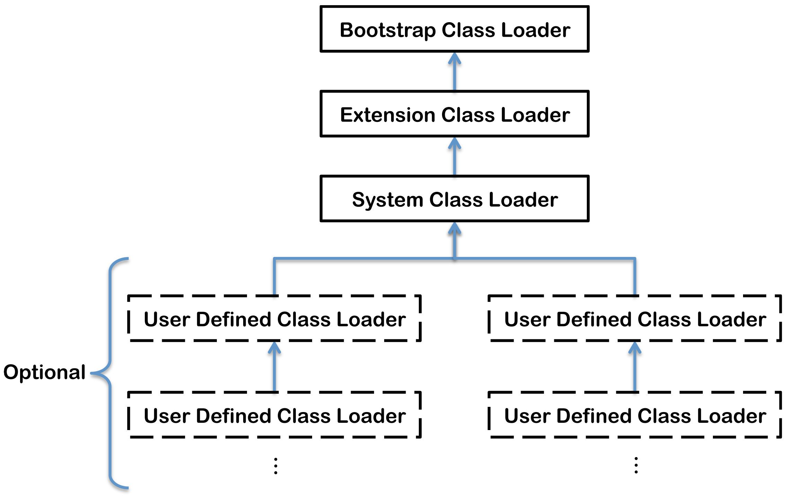
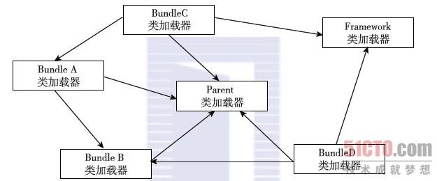

# Java 虚拟机 #

## 1. JVM内存区域与内存溢出异常 ##

### 1.1 运行时数据区和直接内存 ###

运行时数据区包括：程序计数器，JAVA栈，本地方法栈，方法区，JAVA堆。

<div align="center"></div>

- **程序计数器** 线程私有，存储线程当前执行的字节码指令的位置，如果执行的是Native方法，则为空值（Undefined）
- **JAVA栈** 线程私有，存储方法执行的过程，请求的栈深度大于虚拟机允许的最大深度时会抛出StackOverflowError，可扩展的栈无法扩展时（内存无可用空间时）会抛出OutofMemeryError
- **本地方法栈** 线程私有，用来执行Native方法，作用和可抛出异常与JAVA栈相同。Hotspot虚拟机将JAVA栈和本地方法栈合二为一
- **方法区** 线程共享，用来存储类的信息（类名，方法名，成员变量名）、常/静态变量和运行时常量池。版本更迭对方法区的变化具体详见下一节[1.2 HotSpot 虚拟机方法区的演变](#1.2 方法区)。无法扩展时也会抛出OutofMemeryError。
  - **运行时常量池**（Hotspot1.7已移除，字面量进入java堆中，符号引用进入native堆） 运行时常量池是方法区的一部分，存储字面量和符号引用，可动态扩展如`String.intern`
- **JAVA堆** 线程共享 线程共享，分配对象和数组
- **直接内存** 不是运行时数据区的一部分，提供给Native函数库来直接分配堆外内存，通过`DirectByteBuffer`对象来操作这块内存。直接操作堆外内存好处是，避免了数据flush到远程时Java堆和Native堆来回复制数据，因为JAVA堆中的数据flush到远程时，JAVA堆会先复制到Native堆。

### 1.2 HotSpot 虚拟机方法区的演变 ###

Java1.6 及 1.6 之前，HotSpot 虚拟机中将GC分代收集扩展到了方法区，使用永久代来实现了方法区。此时的永久带中包含类的信息（类名，方法名，成员变量名）、常/静态变量和运行时常量池。

Java1.7 时 HotSpot 将运行时常量区从永久带移除，在 Java 堆（Heap）中开辟了一块区域存放运行时常量池。

Java1.8 时 HotSpot 彻底没有了永久带，而是将方法区放在一个与堆不相连的本地内存区域，这个区域被叫做元空间，运行时常量池仍然放在 Java 堆中。

### 1.3 Java 堆的内存分配 ###

所有对象实例都在这里分配内存。

是垃圾收集的主要区域（"GC 堆"），现代的垃圾收集器基本都是采用分代收集算法，该算法的思想是针对不同的对象采取不同的垃圾回收算法，因此虚拟机把 Java 堆分成以下三块：

- 新生代（Young Generation）
- 老年代（Old Generation）
- 永久代（Permanent Generation）

当一个对象被创建时，它首先进入新生代，之后有可能被转移到老年代中。新生代存放着大量的生命很短的对象，因此新生代在三个区域中垃圾回收的频率最高。为了更高效地进行垃圾回收，把新生代继续划分成以下三个空间：

- Eden
- From Survivor
- To Survivor

<div align="center"></div>

###### JVM内存管理参数 ######

- **-Xms**  初始化内存（年轻带+年老带）的大小
- **-Xmx**  内存的最大大小
- **-Xss**  每个线程的栈大小
- **-XX:NewSize**  新生代初始大小
- **-XX:MaxNewSize**  新生代最大大小
- **-Xmn**  新生代固定大小
- **-XX:SurvivorRatio N**  伊甸园区与幸存者区的比例，具体为`Eden : Survivor From : Survivor To = N : 1 : 1`
- **-XX:NewRatio N**  新生代和老年代的比例，具体为`Old : Young = 1 : N`

### 1.4 对象的内存布局和定位 ###

对象的内存布局包括三部分：对象头，实例数据和对齐填充

- **对象头**  对象头包括两部分，第一部分存储 Mark Word 即对象运行时数据（哈希值，GC分带年龄，锁状态，偏向线程ID等），第二部分存储类型指针，用来确定对象属于哪个类，但不是所有虚拟机都必须在对象上存储类型指针，因为不通过对象本身也可以查到对象的元数据。
- **实例数据** 存储对象的各种字段（包括父类的），相同的宽度的字段总是存放在一起
- **对齐填充** 将对象大小填充至8字节的整数倍

###### 对象的访问定位 ######

栈上的数据通过 reference 数据来操作栈中的数据，reference 访问方式有两种：句柄和直接指针

- **句柄**  JAVA 堆中划分出一块区域来存储句柄，句柄中存储了对象的数据指针和类型指针。reference 先访问句柄，在通过句柄存储的指针到具体的数据和类型。
- **直接指针**  reference 直接存储对象的数据指针，使用直接指针访问模式的堆实例数据，数据中包含了对象类型的指针。

句柄的好处是，当数据地址修改时，只需要修改句柄中的地址，reference 本身不需要修改；直接指针的好处是速度更快。Hotspot 使用的是直接指针的方式访问对象。

###### OOP-KLASS ######

OOP-KLASS 是 HotSpot 中存储对象的一种方式，OOP（Ordinary Object Pointer）普通对象指针，具体使用 instanceOopDesc 和 arrayOopDesc分别描述普通类和数组的对象头；KLASS 使用 instanceKlass 和 arrayKlass 描述对象具体类型。

下图就是 HotSpot 根据引用找到类元信息的示例，先通过引用找到堆中的对象，在根据对象中的 instanceOopDesc 找到类元信息。

<div align="center"></div>


## 2. 垃圾收集器与内存分配策略 ##

### 2.1 对象存活判定 ###

- **引用计数法** 基本不使用，无法解决孤岛问题
- **可达性算法** 是否从`GC Roots`可达判定存项是否存活。可以作为`GC Roots`的对象：
  - JAVA栈和本地方法栈中的对象
  - 方法区的常/静态引用变量

两次标记判定对象是否死亡：

第一次，标记`GC Roots`中不可达的对象，将覆盖了`finalize()`方法且还没有执行过的对象，加入`F-Quene`队列中，否则加入即将回收集合。（`F-Queue`中的对象稍后会有优先级比较低的Finalizer线程执行它们的`finalize()`方法） 第二次，重新对`F-Quene`队列中的对象标记，如果从`GC Roots`重新可达，则移出即将回收的集合，最后仍在即将回收集合的对象判定为死亡。

`finalize()`拯救成功示例：

```java
@Override  
protected void finalize() throws Throwable {  
    super.finalize();  
    OneGCRoot.someField = this;  
} 
```


### 2.2 方法区的回收 ###

方法区主要回收两个内容，无用的字面量和无用的类。字面量的回收和对象的回收过程基本相同，类的回收需要以下复杂的判定：

- 类的所有实例已被回收
- 加载该类的ClassLoader已被回收
- 类的Class对象不会被引用，反射不会再访问该类

### 2.3. 引用类型 ###

无论是通过引用计算算法判断对象的引用数量，还是通过可达性分析算法判断对象的引用链是否可达，判定对象是否可被回收都与引用有关。

Java 具有四种强度不同的引用类型。

**（一）强引用**

被强引用关联的对象不会被垃圾收集器回收。

使用 new 一个新对象的方式来创建强引用。

```java
Object obj = new Object();
```

**（二）软引用**

被软引用关联的对象，只有在内存不够的情况下才会被回收。软引用非常适合于创建内存敏感的数据缓存。 

使用 SoftReference 类来创建软引用。

```java
Object obj = new Object();
SoftReference<Object> sf = new SoftReference<Object>(obj);
obj = null; // 使对象只被软引用关联
```

**（三）弱引用**

被弱引用关联的对象一定会被垃圾收集器回收，也就是说它只能存活到下一次垃圾收集发生之前。

使用 WeakReference 类来实现弱引用。

```java
Object obj = new Object();
WeakReference<Object> wf = new WeakReference<Object>(obj);
obj = null;
```

WeakHashMap 的 Entry 继承自 WeakReference，主要用来防止内存泄漏。

```java
private static class Entry<K,V> extends WeakReference<Object> implements Map.Entry<K,V>
```

Tomcat 中的 ConcurrentCache 就使用了 WeakHashMap 来实现缓存功能。ConcurrentCache 采取的是分代缓存，经常使用的对象放入 eden 中，而不常用的对象放入 longterm。eden 使用 ConcurrentHashMap 实现，longterm 使用 WeakHashMap，保证了不常使用的对象容易被回收。

```java
public final class ConcurrentCache<K, V> {

    private final int size;

    private final Map<K, V> eden;

    private final Map<K, V> longterm;

    public ConcurrentCache(int size) {
        this.size = size;
        this.eden = new ConcurrentHashMap<>(size);
        this.longterm = new WeakHashMap<>(size);
    }

    public V get(K k) {
        V v = this.eden.get(k);
        if (v == null) {
            v = this.longterm.get(k);
            if (v != null)
                this.eden.put(k, v);
        }
        return v;
    }

    public void put(K k, V v) {
        if (this.eden.size() >= size) {
            this.longterm.putAll(this.eden);
            this.eden.clear();
        }
        this.eden.put(k, v);
    }
}
```

> **为什么使用弱引用？**
>
> 考虑下面的场景：现在有一个Product类代表一种产品，这个类被设计为不可扩展的，而此时我们想要为每个产品增加一个编号。一种解决方案是使用HashMap<Product, Integer>。于是问题来了，如果我们已经不再需要一个Product对象存在于内存中（比如已经卖出了这件产品），假设指向它的引用为productA，我们这时会给productA赋值为null，然而这时productA过去指向的Product对象并不会被回收，因为它显然还被HashMap引用着。所以这种情况下，我们想要真正的回收一个Product对象，仅仅把它的强引用赋值为null是不够的，还要把相应的条目从HashMap中移除。显然“从HashMap中移除不再需要的条目”这个工作我们不想自己完成，我们希望告诉垃圾收集器：在只有HashMap中的key在引用着Product对象的情况下，就可以回收相应Product对象了。显然，根据前面弱引用的定义，使用弱引用能帮助我们达成这个目的。我们只需要用一个指向Product对象的弱引用对象来作为HashMap中的key就可以了。

**（四）虚引用**

又称为幽灵引用或者幻影引用。一个对象是否有虚引用的存在，完全不会对其生存时间构成影响，也无法通过虚引用取得一个对象实例。

为一个对象设置虚引用关联的唯一目的就是能在这个对象被收集器回收时收到一个系统通知。

使用 PhantomReference 来实现虚引用。

```java
Object obj = new Object();
PhantomReference<Object> pf = new PhantomReference<Object>(obj);
obj = null;
```

### 2.4 GC算法 ###

- **标记清除算法**  标记对象存活状态，然后清除死亡对象。缺点是容易产生内存碎片（不连续的内存空闲区域），效率也不高
- **复制算法**  需要大小相同的两块内存，每次使用其中的一块，当一块用完了，将存活的对象复制到另一块去，并清空当前块内存。运行高效，但需要空出一半内存。
- **标记整理算法**  标记对象存活状态，然后将存活对象向一端移动，再清空另一端的内存
- **分区收集算法**  将内存划分区域，根据对象的存活周期采用不同的收集算法。老年代由于存活概率大，复制成本高，一般采用标记清除算法或标记整理算法；年轻代一般使用复制算法

### 2.5 内存分配与回收策略 ###

内存第一次分配一般会分配在Eden区，若开启了TLAB会有限分配在TLAB，当对象比较大时，会直接进入老年代。

> 为什么要有TLAB（Thread Local Allocation Buffer） 如果对象在一个共享的空间中分配，我们需要采用一些同步机制来管理这些空间内的空闲空间指针。在Eden空间中，每一个线程都有一个固定的分区用于分配对象，即一个TLAB。分配对象时，线程之间不再需要进行任何的同步。

之后当Eden区无法再分配内存时，会触发一次`minor GC`，将Eden区和非空Survivor区中存活的对象（满足晋升年龄的对象进入老年代）复制到另一个Survivor区，然后清空之前的Survivor区。

> 满足晋升年龄有两种，第一种是经过若干次GC后仍存活，第二种是当Survivor区中相同年龄的所有对象大小总和大于Survivor空间的一般，大于等于这个年龄的也会晋升到老年代。通过把第二种成为动态年龄判定。

空间分配担保：每次`minor GC`前，会检查老年代剩余空间是否大于新生代所有对象的总空间，如果大于显然不会有问题，如果小于就可能出现老年代空间不足的情况。担保机制对这种情况的处理时，若不允许担保，直接进行一次`full GC`，若允许担保，当老年代剩余空间大与之前历次晋升到老年代对象的平均大小，则称担保成功，允许`minor GC`（这样的担保是有风险的，因若某次`minor GC`的存活对象激增，那么最终也会导致担保失败），若担保失败，进行一次`full GC`。

### 2.6 分代或分区的可达性分析（Remebered Set 与 Card Table） ###

一般来说，GC过程是这样的：首先枚举根节点。根节点有可能在新生代中，也有可能在老年代中。这里由于我们只想收集新生代（换句话说，不想收集老年代），而且老年代中的对象一般是比较多的，所以实在没有必要对位于老年代的`GC Roots`做全面的可达性分析。但问题是，确实可能存在位于老年代的某个`GC Root`，它引用了新生代的某个对象，这个对象你是不能清除的。那怎么办呢？事实上，对于位于不同年代对象之间的引用关系，虚拟机会在程序运行过程中给记录下来。对应上面所举的例子，“老年代对象引用新生代对象”这种关系，会在引用关系发生时，在新生代边上专门开辟一块空间记录下来，这就是`Remembered Set`，`Remembered Set`记录的是新生代的对象被老年代引用的关系。所以“`GC Roots`” + “`Remembered Set`存储的内容”，才是新生代收集时真正的`GC Roots`。然后就可以以此为据，在新生代上做可达性分析，进行垃圾回收。

> 当然，有可能发生的是比如老年代对象O持有新生代对象N，O对象其实已经死了只不过还没有进行`major GC`来回收，这样N就会在这次`minor GC`中存活下来，但没关系，后面的GC最终还是会把N回收回去的，相比于时间效率，延迟回收一些死对象是可以接受的（当然也有一个原因是这种死对象通常不会很多，也不会存活很久）。

扩展到更一般的情况，在分代收集方法中，当对一个区域进行收集时，可以使用`GC Roots`+`持有该区对象引用的其他区域对象`为根在该区域内做可达性分析。而`持有该区对象引用的其他区域对象`怎么样获取呢？对于位于不同年代（即区域）对象之间的引用关系，虚拟机会在程序运行过程中给记录下来，如“老年代对象引用新生代对象”这种关系，会在引用关系发生时，在新生代边上专门开辟一块空间记录下来，这就是`Remembered Set`。

一个内存区域的`Remembered Set`，一般记录的是其他区域区域对本区域的引用持有关系，这种关系一般称之为`point-into`。还有一种关系记录方式就是`Card Table`，是用来记录本区域对其他区域的引用持有关系，这种关系一般称之为`point-out`。

`Card Table`具体怎样实现？将一个内存区域划分若干大小相等的小块，每个小块将其称之为一个`Card`，大小一般为`128KB~512KB`，对应`Card Table`使用1字节来记录这个`Card`上的信息。每当某个`Card`对其他区域持有引用时，可以将`Card Table`对应字节的某一位来标记，同时`Card Table`还可以标记对应`Card`在某个时间段内有没有被修改，若被修改过，这个`Card`称为`Dirty Card`（脏Card）。`Dirty Card`的记录对`Remebered Set`有重要作用。`mutator`可以在执行写操作时设置一段写屏障，用于更新被修改对象所在区域的`Card Table`值。

一般新生代收集器都是使用`GC Roots`和老年区的`Card Table`来完成新生代的垃圾收集的。由于新生代一般使用复制算法，所以可以把上一次`minor GC`开始时（STW开始时）到这一次`minor GC`开始时（STW开始时）老年区所有的`Dirty Card`作为老年代持有新生代的根。

### 2.7 并发标记（Incremental Update 与 Snapshot at the beginning） ###

并发标记一般是指`Root Tracing`的过程和正常工作线程一同进行，既然和正常工作线程一同进行，那么Tracing的过程中就会有引用关系的变化，有可能遍历完一个对象O的所有引用变量后，将一个还未遍历的对象引用U赋值给O的某个引用遍量，并删除了U的原引用关系，那么U就不会在被遍历到，就会被当成死亡对象回收。这一过程可以描述成下面这段代码：

```
O.u = P.u;  //O的所有引用变量已经遍历完
P.u = null; //P的u变量还没有遍历就被从P删除了，这样Tracing判定u不可达而就行回收
```

要了解如何解决这个问题之前，先了解下三色标记法，使用3种颜色标记扫描状态。 
**黑色**: 根对象，或者该对象与它的子对象都被扫描 。
**灰色**: 对象本身被扫描,但还没扫描完该对象中的子对象 。
**白色**: 未被扫描对象，扫描完成所有对象之后，最终为白色的为不可达对象，即垃圾对象。

那么造成一个白色的对象被漏标的充要条件就是：

1. mutator插入了一个黑色对象到白色对象的引用
2. mutator删除了所有灰色对象到该白色对象的直接或间接引用

换一句话说，如果以上两个条件的一个不满足，也不会导致白色对象被漏标。所有要避免漏标，只需要打破其中一个条件即可。解决白色被漏标一般有两种方法`Incremental Update`和`SATB(Snapshot at the beginning)`。`Incremental Update`关注第一个条件的打破，具体做法为每次当mutator插入了一个黑色对象到白色对象的引用，都使用`write barrier`把这个白色对象记录下来，之后再STW的重新遍历一遍记录的白色对象即可（实际做法可能会有很多变种，比如记录黑色对象重新扫描未被扫描的引用变量）；`STAB`关注第二个条件的打破，即引用关系的删除，`SATB`使用`pre write barriar`将所有即将删除的旧引用关系记录下来，最后以这些就引用为根STW的重新扫描一遍即可（实际做法也有很多变种）。

`Incremental Update`与`SATB`相比，一般前者前者产生需要重新扫描的引用要少一点，但前者有一个最大坏处是无法监测栈上新增变量持有白色对象的情况（因为新增变量都默认为黑色，被持有白色对象时 Incremental Update 观测不到），导致CMS使用`Incremental Update`在重新标记阶段必须在遍历一遍`GC Roots`。

### 2.8 安全点（Safe Point） ###

线程的执行可能导致引用的关系的变化，需要设置一些安全点让线程再合适的位置暂停下来，等待GC完成后恢复，安全点的选取不能再多也不能太少，一般具有指令序列复用的指令才会产生安全点。GC中断其他线程时有两种中断方法，抢先式中断和主动式中断。

- 抢先式中断  GC时中断所有线程，在让不在安全点上的线程跑到安全点上。这种中断方式很少采用
- 主动式中断  GC中断时不对线程操作，而是设置一个标志位（线程对标志位的轮询都设置在安全点内），各个线程轮询这个标志位，发现需要GC时就暂停

### 2.9 垃圾收集器的发展 ###

新生代：`Serial`(暂停其他线程，单线程GC复制算法) ==> `ParNew`(暂停其他线程，多线程GC复制算法，尽可能缩短每次GC时间) ==> `Parallel Scavenge`(暂停其他线程，多线程GC复制算法，尽可能提高CPU在其他线程的工作率) 
老年代：`Serial Old`(暂停其他线程，单线程GC标记整理算法) ==> `Paralled Old`(暂停其他线程，多线程GC标记整理算法) ==> `CMS` 
跨区域：`G1`

### 2.10 老年代垃圾收集器：CMS ###

CMS垃圾收集器以最短回收停顿为目标，采用标记清除算法，整个GC分为4个阶段：初始标记(STW)、并发标记、重新标记（STW）、并发清除。

- **初始标记(STW)**  标记`GC Roots`能直接关联到的对象
- **并发标记**  遍历初始标记中的灰色对象 ，标记所有能关联到的对象。
- **重新标记(STW)**  重新标记并发标记过程中发生变化的对象
- **并发清除**  清除死亡对象

由于新生代存活对象一般比较少，所有CMS没有使用`Remebered Set`或`Card Table`，而是直接从根全堆扫描。

> 并发标记时，使用`Incerment Update`的做法，具体做法是每次当mutator插入了一个黑色对象到白色对象的引用时，都在`write barrier`标记黑色对象所在区域的`Card Table`值，表示该Card被修改过需要重新扫描。但由于`minor GC`需要也会修改和重置`Card Table`的值，所以CMS引入了新的Bitmap（名为`Mod Union Table`）来避免`Card Table`重置导致信息丢失。具体做法是，每当`minor GC`重置`Card Table`里某个记录时，就在`Mod Union Table`修改对应的Bit位，这样借助`Mod Union Table`+`Card Table`就足够记录并发标记时老年代的所有变化了。 重新标记时，Stop The World，然后重新扫描`GC roots`加上老年区上的脏位对象（使用`Mod Union Table`和`Card Table`标记）就可以扫描出所有存活对象。 问题一，为什么重新扫描还需要扫描`GC roots`呢？这是因为对栈上变量的设值操作（汇编指令不同）没有设置写屏障，有可能某个白色对象被引用到并发期间新增的栈上（并且这个白色对象也被之前的引用对象丢弃），如果不重新扫描`GC roots`，那么就会漏标。 问题二，既然重新扫描还需要扫描`GC roots`那初始标记和并发标记的工作是不是白做了？显然不是，重新扫描`GC roots`时，只需要扫描非黑的引用变量，遇到黑色引用变量直接跳过。那么重新标记其实就是做一些修正工作，耗时会比初始标记稍长一些，但比扫描整个堆快多了。所以CMS缩短了STW的时间。

CMS优点：并发收集，低停顿 CMS缺点：（一）因为并发所以降低吞吐量；（二）因为并发所以需要更大的堆。并发的过程中会又新的对象生成，为了避免并发过程中内存不够用，必须提前开始`major GC`，比如默认老年代使用率超过68%时就会开始收集；（三）因为使用标记清除算法，所以会有内存碎片产生。内存碎片会导致大对象存储时提前触发`Full GC`；（四）会产生“浮动垃圾”。并发标记必须要保证的是活的不能标死，而有可能的是死被标活也是可能发生的（比如黑色对象丢弃了自己的黑色引用变量），但这一般可以接受，因为浮动垃圾下一GC时就会被清除。

CMS触发条件：一是老年代或永久带使用量达到一定阈值；二是老年区担保失败。

### 2.11 跨区域垃圾收集器：G1 ###

特点：并行与并发，分代收集，空间整合，可停顿的预测

G1将内存分为多个大小相等的独立区域，称之为Region，仍保留了新生代和老年代的概念，如新生代的伊甸园区包含由若干Region的集合组成，幸存者区由若干个Region的集合组成，老年代由若干个Region的集合组成，使得内存空间测到充分的利用。其GC过程是把一个或多个区域的存活对象拷贝到一个空的Region完成清理工作，这样就不会有碎片问题存在了。每个Region都有自己的`Card Table`和`Remebered Set`。

G1对巨型对象的存储，当一个对象的大小超过Region大小的一半时，G1认为这是一个巨型对象，会把它存到一个叫Humongous的区域，简称H区，当一个H区存不下巨型对象时，会寻找连续的H区，找不到满足要求的连续H区，会不得不触发一次`Full GC`。

G1会每隔一定时间启动一次全局并发标记，基于此G1可以直到哪些Region收集价值最大。**全局并发标记过程**：

1. 初始标记（STW）  标记`GC Roots`可直达对象（压入`Marking Stack`中），一般借助`G1 Young GC`完成。

2. 并发标记  从初始标记开始遍历整个堆（借助`Marking Stack`），同时也对`SATB writer barrair`记录的对象遍历

   > 记忆点：并发标记进行可达性算法的同时，同时处理引用更改（每个线程会记录更改，更改队列满时加入全局对象，专门全局线程会处理）的对象

3. 最终标记（STW）  接着处理`SATB writer barrair`没遍历完的对象。

   > 记忆点：接着处理更改

4. 筛选回收（STW）  若某个Region没有存活对象，直接回收。然后对Region回收价值排序，对象存活越少的Region回收价值越高。

> `SATB writer barrair`维护了一个队列，记录每个mutator丢弃旧引用对象，每个对象都这样一个队列，叫做`SATB Marked Quene`，每当某个线程的`SATB Markde Quene`满时，线程都将其加入到全局的`SATB Marked Quene Set`中，然后线程获得一个新的空队列继续记录。每当`SATB Marked Quene Set`超过一定长度阈值时，并发标记线程都将队列中的所有对象压入`marking stack`上，等待进一步标记。 
>
> 为了不影响mutator性能，`SATB writer barrair`对`RSet`也维护了一个队列。每当某个对象的引用变量属于跨区域更新时（如`a=b`a与b属于不同Region，那么a进入队列），就把这个对象加入线程的`Dirty Card Quene`，也称`Remebered Set Log`，每当某个线程这个队列满是，就将队列加入全局的`Dirty Card Quene Set`，也叫做`filled RS buffers`。会有一个线程监测这个全局队列，没当超过一定超度时就取出对象更新对象所在`Card Table`，并将`Card`加入到对应的`Rset`中。 
> `SATB Marked Quene Set`只在全局并发扫描时开启，`Dirty Card Quene Set`始终会进行维护。 
>
> G1的`RSet`只记录`Old -> Young`和`Old -> Old`两种关系，对`RSet`清理工作相当于在对象转移到新`Region`时进行了。 
>
> 当某个Region中的对象非常受欢迎，被许多其他Region引用时，可能会导致`RSet`非常大。G1对于此采用了3种方式记录对象，当`point-into`关系比较少时，记录对象`Card`位置索引；当关系稍多一点，采用细粒度的方式，只记录对象的`Region`位置索引；当关系很多时，只记录`Region`数量。显然粗粒度记录方式需要遍历整个堆才能获取具体的引用关系。

G1提供了两种GC模式，`Young GC`和`Mixed GC`，两种都是STW（STOP THE WORLD）的。`Collection Set`简称`CSet`指的是一次收集中所有被收集的`Region`集合，当GC完`CSet`中的Region都会被回收。

`G1 Young GC (完全STW)`：主要是对新生代进行GC，在Eden区满时触发，将Eden区的存活对象复制到Survivor区，Survivor区的数据移动到新的Survivor区中，Survivor区的部分满足GC年龄的对象晋升到老年代。当Survivor空间不足时，部分Eden区的数据也会提前进入老年代。
`G1 Mixed GC (完全STW)`：不仅进行正常的新生代垃圾收集，同时也回收后台扫描线程标记的部分（回收价值最高，且预测不会超时）的老年代分区。

`YGC(G1 Young GC)`和`MGC(G1 Mixed GC)`步骤大致相同。具体步骤：

1. 根扫描，使用`GC Roots`扫描所有CSet中的Region
2. 处理`Dirty Card`队列更新RSet，以CSet中的Region所有RSet的所有对象为根在CSet中扫描
3. `G1 Young GC`把新生代存活对象复制到`新Survivor`区或`Old`区（对象晋升），`G1 Mixed GC`除了前面步骤外还要把CSet中老年代存活对象复制到新的`Old`中
4. 处理引用队列（软引用，弱引用，虚引用）

可以发现G1的两种GC模式都是要对全部新生代进行回收的，所以在维护`RSet`时会忽略从新生代指出的引用更新。

G1垃圾回收模式的选择： 

- 当老年区（包括H区）占堆比较小时，每次Eden区满触发`G1 Young GC`；
- 当老年区（包括H区）占堆比超过一定比例时，每次Eden区满触发`G1 Mixed GC`；
- 当内存回收回收速度赶不上使用速度最终导致老年代无法再存储时，会调用`Serial Old`触发`full GC`。

> 注：在最早的时候，只是简单判断整个堆（新生代和老年代）总使用量来决定是触发`G1 Young GC`还是`G1 Mixed GC`。


## 3. 类加载机制 ##

### 3.1 类的生命周期 ###

类的生命周期包括：加载，连接（验证，准备，解析），初始化，使用，卸载。

* **加载**，加载一个类需要完成3个步骤：

  1. 通过类的全限定名来获取定义此类的二进制字节流
  2. 将字节流所代表的静态存储结构转化为方法区的运行时数据结构
  3. 再内存中生成一个类的Class对象，作为方法区这个类各种操作的入口

* **连接**

  * **验证**，确保Class文件的字节流符合虚拟机要求，不会危害虚拟机自身安全，具体包括
    1. 文件格式验证：验证字节流是否符合 Class 文件格式的规范，并且能被当前版本的虚拟机处理。
    2. 元数据验证：对字节码描述的信息进行语义分析，以保证其描述的信息符合 Java 语言规范的要求。
    3. 字节码验证：通过数据流和控制流分析，确保程序语义是合法、符合逻辑的。
    4. 符号引用验证：发生在虚拟机将符号引用转换为直接引用的时候，对类自身以外（常量池中的各种符号引用）的信息进行匹配性校验。
  * **准备**，为类变量分配内存并设置初值，通常为数据的零值，final变量会直接设置为相应的值。
  * **解析**，将常量池中的符号引用替换为直接接引。解析过程在某些情况下可以在初始化阶段之后再开始，这是为了支持 Java 的动态绑定。

* **初始化**，类变量复制和静态块执行

  有且只有5种情形必须立即初始化类：

  1. 遇到new、getstatic、putstatic、invokestatic指令，即使用new关键字实例化类，读取或设置类的静态变量，或调用类的静态方法时类未初始化。
  2. 反射调用类时该类未初始化
  3. 初始化一个类时，父类未初始化
  4. 虚拟器启动，会初始化主类
  5. 动态语言支持中，MethodHandle句柄解析到类的设置读取静态变量或调用静态方法，该类未初始化

  以上 5 种场景中的行为称为对一个类进行主动引用。除此之外，所有引用类的方式都不会触发初始化，称为被动引用。被动引用的常见例子包括：

  1. 通过子类引用父类的静态字段，不会导致子类初始化。

     ```
     System.out.println(SubClass.value); // value 字段在 SuperClass 中定义
     ```

  2. 通过数组定义来引用类，不会触发此类的初始化。该过程会对数组类进行初始化，数组类是一个由虚拟机自动生成的、直接继承自 Object 的子类，其中包含了数组的属性和方法。

     ```
     SuperClass[] sca = new SuperClass[10];
     ```

  3. 常量在编译阶段会存入调用类的常量池中，本质上并没有直接引用到定义常量的类，因此不会触发定义常量的类的初始化。

     ```
     System.out.println(ConstClass.HELLOWORLD);
     ```


### 3.2 类加载器 ###

实现类的加载动作。在 Java 虚拟机外部实现，以便让应用程序自己决定如何去获取所需要的类。

从Java虚拟机角度看存在两种类加载器：

* 一是启动类加载器（Bootstrap ClassLoader），Hotspot使用C++实现；
* 二是其他的类加载器，独立于虚拟机外部，并且全部继承抽象类java.lang.ClassLoader。

从 Java 开发人员的角度看，类加载器可以划分得更细致一些：

- **启动类加载器（Bootstrap ClassLoader）** 此类加载器负责将存放在 <JAVA_HOME>\lib 目录中的，或者被 -Xbootclasspath 参数所指定的路径中的，并且是虚拟机识别的（仅按照文件名识别，如 rt.jar，名字不符合的类库即使放在 lib 目录中也不会被加载）类库加载到虚拟机内存中。启动类加载器无法被 Java 程序直接引用，用户在编写自定义类加载器时，如果需要把加载请求委派给启动类加载器，直接使用 null 代替即可。
- **扩展类加载器（Extension ClassLoader**）这个类加载器是由 `ExtClassLoader(sun.misc.Launcher$ExtClassLoader)`实现的。它负责将 <JAVA_HOME>/lib/ext 或者被 java.ext.dir 系统变量所指定路径中的所有类库加载到内存中，开发者可以直接使用扩展类加载器。
- **应用程序类加载器（Application ClassLoader**）这个类加载器是由 AppClassLoader（sun.misc.Launcher$AppClassLoader）实现的。由于这个类加载器是 ClassLoader 中的 getSystemClassLoader() 方法的返回值，因此一般称为系统类加载器。它负责加载用户类路径（ClassPath）上所指定的类库，开发者可以直接使用这个类加载器，如果应用程序中没有自定义过自己的类加载器，一般情况下这个就是程序中默认的类加载器。

### 3.3 双亲委派模型 ###

应用程序都是由三种类加载器相互配合进行加载的，如果有必要，还可以加入自己定义的类加载器。

下图展示的类加载器之间的层次关系，称为类加载器的双亲委派模型（Parents Delegation Model）。该模型要求除了顶层的启动类加载器外，其余的类加载器都应有自己的父类加载器。这里类加载器之间的父子关系一般通过组合（Composition）关系来实现，而不是通过继承（Inheritance）的关系实现。

<div align=center></div>

**（一）工作过程**

一个类加载器首先将类加载请求传送到父类加载器，只有当父类加载器无法完成类加载请求时才尝试加载。

**（二）好处**

使得 Java 类随着它的类加载器一起具有一种带有优先级的层次关系，从而是的基础类得到统一。

例如 java.lang.Object 存放在 rt.jar 中，如果编写另外一个 java.lang.Object 的类并放到 ClassPath 中，程序可以编译通过。因为双亲委派模型的存在，所以在 rt.jar 中的 Object 比在 ClassPath 中的 Object 优先级更高，因为 rt.jar 中的 Object 使用的是启动类加载器，而 ClassPath 中的 Object 使用的是应用程序类加载器。正因为 rt.jar 中的 Object 优先级更高，因为程序中所有的 Object 都是这个 Object。

**（三）实现**

以下是抽象类 java.lang.ClassLoader 的代码片段，其中的 loadClass() 方法运行过程如下：先检查类是否已经加载过，如果没有则让父类加载器去加载。当父类加载器加载失败时抛出 ClassNotFoundException，此时尝试自己去加载。

```java
public abstract class ClassLoader {
    // The parent class loader for delegation
    private final ClassLoader parent;

    public Class<?> loadClass(String name) throws ClassNotFoundException {
        return loadClass(name, false);
    }

    protected Class<?> loadClass(String name, boolean resolve) throws ClassNotFoundException {
        synchronized (getClassLoadingLock(name)) {
            // First, check if the class has already been loaded
            Class<?> c = findLoadedClass(name);
            if (c == null) {
                try {
                    if (parent != null) {
                        c = parent.loadClass(name, false);
                    } else {
                        c = findBootstrapClassOrNull(name);
                    }
                } catch (ClassNotFoundException e) {
                    // ClassNotFoundException thrown if class not found
                    // from the non-null parent class loader
                }

                if (c == null) {
                    // If still not found, then invoke findClass in order
                    // to find the class.
                    c = findClass(name);
                }
            }
            if (resolve) {
                resolveClass(c);
            }
            return c;
        }
    }

    protected Class<?> findClass(String name) throws ClassNotFoundException {
        throw new ClassNotFoundException(name);
    }
}
```

**自定义类加载器实现**

FileSystemClassLoader 是自定义类加载器，继承自 java.lang.ClassLoader，用于加载文件系统上的类。它首先根据类的全名在文件系统上查找类的字节代码文件（.class 文件），然后读取该文件内容，最后通过 defineClass() 方法来把这些字节代码转换成 java.lang.Class 类的实例。

java.lang.ClassLoader 类的方法 loadClass() 实现了双亲委派模型的逻辑，因此自定义类加载器一般不去重写它，而是通过重写 findClass() 方法。

```java
public class FileSystemClassLoader extends ClassLoader {

    private String rootDir;

    public FileSystemClassLoader(String rootDir) {
        this.rootDir = rootDir;
    }

    protected Class<?> findClass(String name) throws ClassNotFoundException {
        byte[] classData = getClassData(name);
        if (classData == null) {
            throw new ClassNotFoundException();
        } else {
            return defineClass(name, classData, 0, classData.length);
        }
    }

    private byte[] getClassData(String className) {
        String path = classNameToPath(className);
        try {
            InputStream ins = new FileInputStream(path);
            ByteArrayOutputStream baos = new ByteArrayOutputStream();
            int bufferSize = 4096;
            byte[] buffer = new byte[bufferSize];
            int bytesNumRead;
            while ((bytesNumRead = ins.read(buffer)) != -1) {
                baos.write(buffer, 0, bytesNumRead);
            }
            return baos.toByteArray();
        } catch (IOException e) {
            e.printStackTrace();
        }
        return null;
    }

    private String classNameToPath(String className) {
        return rootDir + File.separatorChar
                + className.replace('.', File.separatorChar) + ".class";
    }
}
```
### 3.4 OSGI 加载机制

OSGi的类加载架构并未遵循Java所推荐的双亲委派模型（Parents Delegation Model），它的类加载器通过严谨定义的规则从Bundle的一个子集中加载类。除了Fragment Bundle外，每一个被正确解析的Bundle都有一个独立的类加载器支持，这些类加载器之间互相协作形成了一个类加载的代理网络架构，因此OSGi中采用的是网状的类加载架构，而不是Java传统的树状类加载架构，如图所示。 

 

在OSGi中，类加载器可以划分为３类。

父类加载器：由Java平台直接提供，最典型的场景包括启动类加载器（Bootstrap ClassLoader）、扩展类加载器（Extension ClassLoader）和应用程序类加载器（Application ClassLoader）。在一些特殊场景中（如将OSGi内嵌入一个Web中间件）还会有更多的加载器组成。它们用于加载以“java.*”开头的类以及在父类委派清单中声明为要委派给父类加载器加载的类。

Bundle类加载器：每个Bundle都有自己独立的类加载器，用于加载本Bundle中的类和资源。当一个Bundle去请求加载另一个Bundle导出的Package中的类时，要把加载请求委派给导出类的那个Bundle的加载器处理，而无法自己去加载其他Bundle的类。

其他加载器：譬如线程上下文类加载器、框架类加载器等。它们并非OSGi规范中专门定义的，但是为了实现方便，在许多OSGi框架中都会使用。例如框架类加载器，OSGi框架实现一般会将这个独立的框架类加载器用于加载框架实现的类和关键的服务接口类。

## 4. Java内存模型

### 4.1 什么是内存模型

内存模型说的是，在多核多线程环境下，各种不同的CPU是如何以一种统一的方式来与内存交互的。由于内存的存取速度远慢于CPU计算速度，所以使用高速缓存供CPU计算时存取数据。具体来说，当程序在运行过程中，会将运算需要的数据从主存复制一份到CPU的高速缓存当中，那么CPU进行计算时就可以直接从它的高速缓存读取数据和向其中写入数据，当运算结束之后，再将高速缓存中的数据刷新到主存当中。 

由于高速缓存的存在，使得程序在多线程或多CPU环境中工作时可能出现问题，因此内存模型需要解决缓存不一致问题。

为了解决缓存不一致性问题，通常来说有以下2种解决方法：

1. 通过在总线加LOCK#锁的方式（即共享变量操作期间禁止其他CPU读写内存，粗暴，但效率低下）
2. 通过缓存一致性协议（写共享变量时，同时写回内存，并使其他线程或CPU对该变量的缓存无效，其他线程再读取改变时，发现高速缓存无效，就会直接从内存中读取。

这2种方式都是硬件层面上提供的方式。

### 4.2 有关并发编程的3个概念

**原子性：** 操作不可拆分，要么不完成，要么全部完成

**可见性：** 一个线程修改共享变量时对其他线程的可见性

**有序性：** 指程序按照代码先后顺序执行，但语序指令重排，保证单线程下重排后的指令的执行结果和未重排时结果一致

### 4.3 Java内存模型

Java内存模型规定所有的变量都是存在主存当中（类似于前面说的物理内存），每个线程都有自己的工作内存（类似于前面的高速缓存）。线程对变量的所有操作都必须在工作内存中进行，而不能直接对主存进行操作。并且每个线程不能访问其他线程的工作内存。 

举个简单的例子：在java中，执行下面这个语句：

```c
i = 10;
```

 执行线程必须先在自己的工作线程中对变量i所在的缓存行进行赋值操作，然后再写入主存当中。而不是直接将数值10写入主存当中。

那么Java语言 本身对 原子性、可见性以及有序性提供了哪些保证呢？

**原子性**

在Java中，对基本数据类型的变量的读取和赋值操作是原子性操作，即这些操作是不可被中断的，要么执行，要么不执行。

上面一句话虽然看起来简单，但是理解起来并不是那么容易。看下面一个例子i：

请分析以下哪些操作是原子性操作：

```c
x = 10;         //语句1
y = x;         //语句2
x++;           //语句3
x = x + 1;     //语句4
```

咋一看，有些朋友可能会说上面的4个语句中的操作都是原子性操作。其实只有语句1是原子性操作，其他三个语句都不是原子性操作。

因此，只有**变量的读取和直接赋值是原子操作**。

**可见性**

对于可见性，Java提供了volatile关键字来保证可见性。

当一个共享变量被 volatile 修饰时，它会保证修改的值会立即被更新到主存，当有其他线程需要读取时，它会去内存中读取新值。

而普通的共享变量不能保证可见性，因为普通共享变量被修改之后，什么时候被写入主存是不确定的，当其他线程去读取时，此时内存中可能还是原来的旧值，因此无法保证可见性。

另外，通过synchronized和Lock也能够保证可见性，synchronized和Lock能保证同一时刻只有一个线程获取锁然后执行同步代码，并且在释放锁之前会将对变量的修改刷新到主存当中。因此可以保证可见性。

**有序性**

在Java内存模型中，允许编译器和处理器对指令进行重排序，但是重排序过程不会影响到单线程程序的执行，却会影响到多线程并发执行的正确性。 

Java内存模型具备一些先天的“有序性”，即不需要通过任何手段就能够得到保证的有序性，这个通常也称为 happens-before 原则。如果两个操作的执行次序无法从happens-before原则推导出来，那么它们就不能保证它们的有序性，虚拟机可以随意地对它们进行重排序。

下面就来具体介绍下happens-before原则（先行发生原则）：

- 程序次序规则：一个线程内，按照代码顺序，书写在前面的操作先行发生于书写在后面的操作（允许重排，但保证单线程执行结果相同)
- 锁定规则：一个unLock操作先行发生于后面对同一个锁额lock操作，显而易见的规则，只有当一个锁解锁后其他线程才能加锁。
- volatile变量规则：对一个变量的写操作先行发生于后面对这个变量的读操作，volatile内存屏障作用。
- 传递规则：如果操作A先行发生于操作B，而操作B又先行发生于操作C，则可以得出操作A先行发生于操作C
- 线程启动规则：Thread对象的start()方法先行发生于此线程的每个一个动作
- 线程中断规则：对线程interrupt()方法的调用先行发生于被中断线程的代码检测到中断事件的发生
- 线程终结规则：线程中所有的操作都先行发生于线程的终止检测，我们可以通过Thread.join()方法结束、Thread.isAlive()的返回值手段检测到线程已经终止执行
- 对象终结规则：一个对象的初始化完成先行发生于他的finalize()方法的开始

前4条规则是比较重要的，后4条规则都是显而易见的。 

> volatile 的两层语义
>
> 由上面可见性和有序性介绍中可以得出volatile**不仅保证了不同线程的可见性，同时禁止了指令重排序**。
>
> volatile关键字禁止指令重排序有两层意思：
>
> 1. 当程序执行到volatile变量的读操作或者写操作时，在其前面的操作的更改肯定全部已经进行，且结果已经对后面的操作可见；在其后面的操作肯定还没有进行；
> 2. 在进行指令优化时，不能将在对volatile变量访问的语句放在其后面执行，也不能把volatile变量后面的语句放到其前面执行