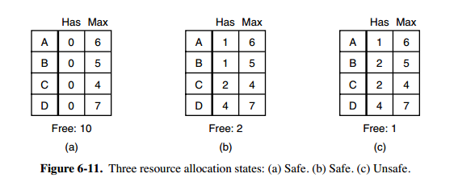
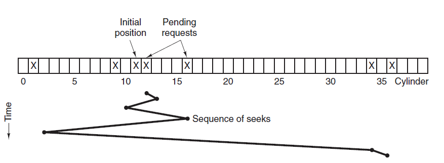

[TOC]

# 操作系统

## 1. 概述

### 1.1 操作系统基本功能

1. **进程管理**  进程控制、进程同步、进程通信、死锁处理、处理机调度等。

2. **内存管理**  内存分配、地址映射、内存保护与共享、虚拟内存等。

3. **文件管理**  文件存储空间的管理、目录管理、文件读写管理和保护等。

4. **设备管理**  完成用户的 I/O 请求，方便用户使用各种设备，并提高设备的利用率。主要包括缓冲管理、设备分配、设备处理、虛拟设备等。

### 1.2 系统调用

如果一个进程在用户态需要使用内核态的功能，就进行系统调用从而陷入内核，由操作系统代为完成。

 

Linux 的系统调用主要有以下这些：

| Task     | Commands                         |
| -------- | -------------------------------- |
| 进程控制 | fork(); vfork(); exit(); wait(); |
| 进程通信 | pipe(); shmget(); mmap();        |
| 文件操作 | open(); read(); write();         |
| 设备操作 | ioctl(); read(); write();        |
| 信息维护 | getpid(); alarm(); sleep();      |
| 安全     | chmod(); umask(); chown();       |

### 1.3 系统中断

有三种常见的中断

1. **外中断**  由 CPU 执行指令以外的事件引起，如 I/O 完成中断，表示设备输入/输出处理已经完成，处理器能够发送下一个输入/输出请求。此外还有时钟中断、控制台中断等。

2. **异常**  由 CPU 执行指令的内部事件引起，如非法操作码、地址越界、算术溢出等。

3. **陷入**  在用户程序中使用系统调用。

## 2. 进程管理

### 2.1 进程与线程

**进程**

进程是资源分配的基本单位。

进程控制块 (Process Control Block, PCB) 描述进程的基本信息和运行状态，所谓的创建进程和撤销进程，都是指对 PCB 的操作。

下图显示了 4 个程序创建了 4 个进程，这 4 个进程可以并发地执行。

[](https://github.com/CyC2018/Interview-Notebook/blob/master/pics/a6ac2b08-3861-4e85-baa8-382287bfee9f.png)

 

**线程**

线程是独立调度的基本单位。

一个进程中可以有多个线程，它们共享进程资源。

[](https://github.com/CyC2018/Interview-Notebook/blob/master/pics/3cd630ea-017c-488d-ad1d-732b4efeddf5.png)

 

**区别**

- 拥有资源：进程是资源分配的基本单位，但是线程不拥有资源，线程可以访问隶属进程的资源。
- 调度：线程是独立调度的基本单位，在同一进程中，线程的切换不会引起进程切换，从一个进程内的线程切换到另一个进程中的线程时，会引起进程切换。
- 系统开销：由于创建或撤销进程时，系统都要为之分配或回收资源，如内存空间、I/O 设备等，所付出的开销远大于创建或撤销线程时的开销。类似地，在进行进程切换时，涉及当前执行进程 CPU 环境的保存及新调度进程 CPU 环境的设置，而线程切换时只需保存和设置少量寄存器内容，开销很小。
- 通信方面：进程间通信 (IPC) 需要进程同步和互斥手段的辅助，以保证数据的一致性。而线程间可以通过直接读/写同一进程中的数据段（如全局变量）来进行通信。

### 2.2 进程状态切换

 

- 就绪状态（ready）：等待被调度
- 运行状态（running）
- 阻塞状态（waiting）：等待资源

应该注意以下内容：

- 只有就绪态和运行态可以相互转换，其它的都是单向转换。就绪状态的进程通过调度算法从而获得 CPU 时间，转为运行状态；而运行状态的进程，在分配给它的 CPU 时间片用完之后就会转为就绪状态，等待下一次调度。
- 阻塞状态是缺少需要的资源从而由运行状态转换而来，但是该资源不包括 CPU 时间，缺少 CPU 时间会从运行态转换为就绪态。

### 2.3 进程调度

#### 2.3.1 批处理系统

批处理系统没有太多的用户操作，在该系统中，调度算法目标是保证吞吐量和周转时间（从提交到终止的时间）。

**先来先服务 first-come first-serverd（FCFS）**

按照请求的顺序进行调度。

有利于长作业，但不利于短作业，因为短作业必须一直等待前面的长作业执行完毕才能执行，而长作业又需要执行很长时间，造成了短作业等待时间过长。

**短作业优先 shortest job first（SJF）**

按估计运行时间最短的顺序进行调度。

长作业有可能会饿死，处于一直等待短作业执行完毕的状态。因为如果一直有短作业到来，那么长作业永远得不到调度。

**最短剩余时间优先 shortest remaining time next（SRTN）**

按估计剩余时间最短的顺序进行调度。当一个作业正在执行时，一个新作业进入就绪状态，如果新作业需要的CPU时间比当前正在执行的作业剩余下来还需的CPU时间短，SRTF强行赶走当前正在执行的作业。==此算法不仅适用于作业调度，同样也适用于进程调度。== 

**高响应比优先（HRRF）**

先来先服务算法FCFS与最短作业优先SJF算法都是片面的调度算法。FCFS只考虑作业等候时间而忽视了作业的计算时间，SJF算法只考虑用户估计的作业计算时间而忽略了作业等待时间。

**响应比定义：**作业进入系统后的等待时间与处理时间之和称作该作业的响应时间，作业的响应时间除以作业处理时间称作响应比，即：

- 响应比 = 1+已等待时间/作业处理时间

作业处理时间由用户给出，是一个常量。

**缺点：**每次计算各道作业的响应比会有一定的时间开销，性能比SJF略差。

#### 2.3.2 交互式系统

**时间片轮转**

将所有就绪进程按 FCFS 的原则排成一个队列，每次调度时，把 CPU 时间分配给队首进程，该进程可以执行一个时间片。当时间片用完时，由计时器发出时钟中断，调度程序便停止该进程的执行，并将它送往就绪队列的末尾，同时继续把 CPU 时间分配给队首的进程。

时间片轮转算法的效率和时间片的大小有很大关系。因为进程切换都要保存进程的信息并且载入新进程的信息，如果时间片太小，会导致进程切换得太频繁，在进程切换上就会花过多时间。

[](https://github.com/CyC2018/Interview-Notebook/blob/master/pics/8c662999-c16c-481c-9f40-1fdba5bc9167.png)

 

**优先级调度**

为每个进程分配一个优先级，按优先级进行调度。

为了防止低优先级的进程永远等不到调度，可以随着时间的推移增加等待进程的优先级。

**多级反馈队列**

如果一个进程需要执行 100 个时间片，如果采用时间片轮转调度算法，那么需要交换 100 次。

多级队列是为这种需要连续执行多个时间片的进程考虑，它设置了多个队列，每个队列时间片大小都不同，例如 1,2,4,8,..。进程在第一个队列没执行完，就会被移到下一个队列。这种方式下，之前的进程只需要交换 7 次。

每个队列优先权也不同，最上面的优先权最高。因此只有上一个队列没有进程在排队，才能调度当前队列上的进程。

可以将这种调度算法看成是时间片轮转调度算法和优先级调度算法的结合。


**不足：**会存在**饥饿问题**。当新进程不断到来，进入较高优先级队列，CPU忙于运行高优先级队列中的进程，低优先级队列中的进程将长时间得不到调度，产生饥饿现象 

#### 2.3.3 实时系统

实时系统要求一个请求在一个确定时间内得到响应。

分为硬实时和软实时，前者必须满足绝对的截止时间，后者可以容忍一定的超时。

### 2.4 进程同步

#### 2.4.1 一些概念

**临界区**

对临界资源进行访问的那段代码称为临界区。

为了互斥访问临界资源，每个进程在进入临界区之前，需要先进行检查。

```
// entry section
// critical section;
// exit section
```

**同步与互斥**

- 同步：多个进程按一定顺序执行；
- 互斥：多个进程在同一时刻只有一个进程能进入临界区。

**信号量**

信号量（Semaphore）是一个整型变量，可以对其执行 down 和 up 操作，也就是常见的 P 和 V 操作。

- **down** : 如果信号量大于 0 ，执行 -1 操作；如果信号量等于 0，进程睡眠，等待信号量大于 0；
- **up** ：对信号量执行 +1 操作，唤醒睡眠的进程让其完成 down 操作。

down 和 up 操作需要被设计成原语，不可分割，通常的做法是在执行这些操作的时候屏蔽中断。

如果信号量的取值只能为 0 或者 1，那么就成为了 **互斥量（Mutex）** ，0 表示临界区已经加锁，1 表示临界区解锁。

#### 2.4.2 经典同步问题

**生产者和消费者问题**

使用信号量实现

**读者-写者问题**

允许多个进程同时对数据进行读操作，但是不允许读和写以及写和写操作同时发生。

一个整型变量 count 记录在对数据进行读操作的进程数量，一个互斥量 count_mutex 用于对 count 加锁，一个互斥量 data_mutex 用于对读写的数据加锁。

**哲学家进餐问题**

[](https://github.com/CyC2018/Interview-Notebook/blob/master/pics/a9077f06-7584-4f2b-8c20-3a8e46928820.jpg)

 

五个哲学家围着一张圆桌，每个哲学家面前放着食物。哲学家的生活有两种交替活动：吃饭以及思考。当一个哲学家吃饭时，需要先拿起自己左右两边的两根筷子，并且一次只能拿起一根筷子。

考虑到如果所有哲学家同时拿起左手边的筷子，那么就无法拿起右手边的筷子，造成死锁。 为了防止死锁的发生，可以设置两个条件：

- 必须同时拿起左右两根筷子；
- 只有在两个邻居都没有进餐的情况下才允许进餐。

### 2.5 进程通信

进程间通信方式一般认为有六种：

1. 管道（半双工，不能区分消息类型，无名管道需要血缘关系，有名管道有同步阻塞问题）
2. 信号（对一些特定事件的处理）
3. 消息队列（读写可同时存在，能区分消息类型，无同步阻塞问题）
4. 共享内存
5. 信号量（用于同步）
6. 套接字（网络通信，可以跨机器）

这六种通信方式的具体使用和优缺点可以参见[Linux 基础 - 进程通信](https://github.com/jerehao/EncyclopediaOfProgramming/blob/master/ProgrammingNotes/LinuxBasics.md)

## 3. 死锁

### 3.1 死锁的必要条件

不可抢占的占有资源和环路等待

### 3.1 死锁处理方法

#### 3.1.1 鸵鸟策略

把头埋在沙子里，假装根本没发生问题。

因为解决死锁问题的代价很高，因此鸵鸟策略这种不采取任务措施的方案会获得更高的性能。当发生死锁时不会对用户造成多大影响，或发生死锁的概率很低，可以采用鸵鸟策略。

大多数操作系统，包括 Unix，Linux 和 Windows，处理死锁问题的办法仅仅是忽略它。

#### 3.1.2 死锁监测与恢复

不试图阻止死锁，而是当检测到死锁发生时，采取措施进行恢复。 

（一）每种类型一个资源的死锁检测

[](https://github.com/CyC2018/Interview-Notebook/blob/master/pics/b1fa0453-a4b0-4eae-a352-48acca8fff74.png)

 

上图为资源分配图，其中方框表示资源，圆圈表示进程。资源指向进程表示该资源已经分配给该进程，进程指向资源表示进程请求获取该资源。

图 a 可以抽取出环，如图 b，它满足了环路等待条件，因此会发生死锁。

每种类型一个资源的死锁检测算法是通过检测有向图是否存在环来实现，从一个节点出发进行深度优先搜索，对访问过的节点进行标记，如果访问了已经标记的节点，就表示有向图存在环，也就是检测到死锁的发生。

（二）每种类型多个资源的死锁检测

[](https://github.com/CyC2018/Interview-Notebook/blob/master/pics/e1eda3d5-5ec8-4708-8e25-1a04c5e11f48.png)

 

上图中，有三个进程四个资源，每个数据代表的含义如下：

- E 向量：资源总量
- A 向量：资源剩余量
- C 矩阵：每个进程所拥有的资源数量，每一行都代表一个进程拥有资源的数量
- R 矩阵：每个进程请求的资源数量

进程 P1 和 P2 所请求的资源都得不到满足，只有进程 P3 可以，让 P3 执行，之后释放 P3 拥有的资源，此时 A = (2 2 2 0)。P2可以执行，执行后释放 P2 拥有的资源，A = (4 2 2 1) 。P1 也可以执行。所有进程都可以顺利执行，没有死锁。

算法总结如下：

每个进程最开始时都不被标记，执行过程有可能被标记。当算法结束时，任何没有被标记的进程都是死锁进程。

1. 寻找一个没有标记的进程 Pi，它所请求的资源小于等于 A。
2. 如果找到了这样一个进程，那么将 C 矩阵的第 i 行向量加到 A 中，标记该进程，并转回 1。
3. 如果没有这样一个进程，算法终止。

（三）死锁恢复

- 利用抢占恢复
- 利用回滚恢复
- 通过杀死进程恢复

#### 3.1.3 死锁预防

在程序运行之前预防发生死锁。

* **破坏互斥条件**  例如假脱机打印机技术允许若干个进程同时输出，唯一真正请求物理打印机的进程是打印机守护进程。

* **破坏占有和等待条件**  一种实现方式是规定所有进程在开始执行前请求所需要的全部资源。

* **破坏不可抢占条件**
* **破坏环路等待**  给资源统一编号，进程只能按编号顺序来请求资源。

#### 3.1.4 死锁避免

在程序运行时避免发生死锁。

（一）安全状态

[](https://github.com/CyC2018/Interview-Notebook/blob/master/pics/ed523051-608f-4c3f-b343-383e2d194470.png)

 

图 a 的第二列 Has 表示已拥有的资源数，第三列 Max 表示总共需要的资源数，Free 表示还有可以使用的资源数。从图 a 开始出发，先让 B 拥有所需的所有资源（图 b），运行结束后释放 B，此时 Free 变为 5（图 c）；接着以同样的方式运行 C 和 A，使得所有进程都能成功运行，因此可以称图 a 所示的状态时安全的。

定义：如果没有死锁发生，并且即使所有进程突然请求对资源的最大需求，也仍然存在某种调度次序能够使得每一个进程运行完毕，则称该状态是安全的。

安全状态的检测与死锁的检测类似，因为安全状态必须要求不能发生死锁。下面的银行家算法与死锁检测算法非常类似，可以结合着做参考对比。

（二）单个资源的银行家算法

一个小城镇的银行家，他向一群客户分别承诺了一定的贷款额度，算法要做的是判断对请求的满足是否会进入不安全状态，如果是，就拒绝请求；否则予以分配。

[](https://github.com/CyC2018/Interview-Notebook/blob/master/pics/d160ec2e-cfe2-4640-bda7-62f53e58b8c0.png)

 

上图 c 为不安全状态，因此算法会拒绝之前的请求，从而避免进入图 c 中的状态。

（三）多个资源的银行家算法

[](https://github.com/CyC2018/Interview-Notebook/blob/master/pics/62e0dd4f-44c3-43ee-bb6e-fedb9e068519.png)

 

上图中有五个进程，四个资源。左边的图表示已经分配的资源，右边的图表示还需要分配的资源。最右边的 E、P 以及 A 分别表示：总资源、已分配资源以及可用资源，注意这三个为向量，而不是具体数值，例如 A=(1020)，表示 4 个资源分别还剩下 1/0/2/0。

检查一个状态是否安全的算法如下：

- 查找右边的矩阵是否存在一行小于等于向量 A。如果不存在这样的行，那么系统将会发生死锁，状态是不安全的。
- 假若找到这样一行，将该进程标记为终止，并将其已分配资源加到 A 中。
- 重复以上两步，直到所有进程都标记为终止，则状态时安全的。

如果一个状态不是安全的，需要拒绝进入这个状态。

## 4. 内存管理

### 4.1 虚拟内存

虚拟内存的目的是为了让物理内存扩充成更大的逻辑内存，从而让程序获得更多的可用内存。同时也解决了多进程执行的问题。

为了更好的管理内存，操作系统将内存抽象成地址空间。每个程序拥有自己的地址空间，这个地址空间被分割成多个块，每一块称为一页。这些页被映射到物理内存，但不需要映射到连续的物理内存，也不需要所有页都必须在物理内存中。当程序引用到一部分不在物理内存中的地址空间时，由硬件执行必要的映射，将缺失的部分装入物理内存并重新执行失败的指令。

### 4.2 分页系统地址映射

- 内存管理单元（MMU）：管理着地址空间和物理内存的转换。
- 页表（Page table）：页（程序地址空间）和页框（内存空间）的映射表。例如下图中，页表的第 0 个表项为 010，表示第 0 个页映射到第 2 个页框。页表项的最后一位用来标记页是否在内存中。

下图的页表存放着 16 个页，这 16 个页需要用 4 个比特位来进行索引定位。因此对于虚拟地址（0010 000000000100），前 4 位是用来存储页面号，而后 12 位存储在页中的偏移量。

（0010 000000000100）根据前 4 位得到页号为 2，读取表项内容为（110 1），它的前 3 为为页框号，最后 1 位表示该页在内存中。最后映射得到物理内存地址为（110 000000000100）。

所以每个作业最多16个页，每个页大小为4K。


### 4.3 页面置换算法

在程序运行过程中，如果要访问的页面不在内存中，就发生缺页中断从而将该页调入内存中。此时如果内存已无空闲空间，系统必须从内存中调出一个页面到磁盘对换区中来腾出空间。

页面置换算法和缓存淘汰策略类似。在缓存系统中，缓存的大小有限，当有新的缓存到达时，需要淘汰一部分已经存在的缓存，这样才有空间存放新的缓存数据。

页面置换算法的主要目标是使页面置换频率最低（也可以说缺页率最低）。

**（一）最佳 Optimal**

所选择的被换出的页面将是最长时间内不再被访问，通常可以保证获得最低的缺页率。

是一种理论上的算法，因为无法知道一个页面多长时间不再被访问。

举例：一个系统为某进程分配了三个物理块，并有如下页面引用序列：


 

开始运行时，先将 7, 0, 1 三个页面装入内存。当进程要访问页面 2 时，产生缺页中断，会将页面 7 换出，因为页面 7 再次被访问的时间最长。

**（二）最近最久未使用 （LRU, Least Recently Used**）

虽然无法知道将来要使用的页面情况，但是可以知道过去使用页面的情况。LRU 将最近最久未使用的页面换出。

为了实现 LRU，需要在内存中维护一个所有页面的链表。当一个页面被访问时，将这个页面移到链表表头。这样就能保证链表表尾的页面时最近最久未访问的。因为每次访问都需要更新链表，因此这种方式实现的 LRU 代价很高。


 

**（三）最近未使用（NRU, Not Recently Used）**

首先，系统为毎一页面设置了两个状态位。当页面被访问 (读或写) 时设置 R 位; 当页面 (即修改页面) 被写入时设置 M 位。当启动一个进程时，它的所有页面的两个位都由操作系统设置成 0，R 位被定期地 (比如在每次时钟中断时) 清零，以区别最近没有被访问的页面和被访问的页面。

当发生缺页中断时，操作系统检査所有的页面并根据它们当前的 R 位和 M 位的值，把它们分为 4 类:

- 第 0 类: 没有被访问，没有被修改
- 第 1 类: 没有被访问，已被修改
- 第 2 类: 已被访问，没有被修改
- 第 3 类: 已被访问，已被修改

NRU 算法随机地从类编号最小的非空类中挑选一个页面淘汰之。

算法隐含的意思是，在最近一个时钟滴答中 (典型的时间是大约 20ms) 淘汰一个没有被访问的已修改页面要比一个被频繁使用的“十净” 页面好。NRU 主要优点是易于理解和能够有效地被实现，虽然它的性能不是最好的，但是已经够用了。

**（四）先进先出（FIFO, First In First Out）**

选择换出的页面是最先进入的页面。

该算法会将那些经常被访问的页面也被换出，从而使缺页率升高。

**（五）第二次机会算法**

FIFO 算法可能会把经常使用的页面置换出去，为了避免这一问题，对该算法做一个简单的修改：

当页面被访问 (读或写) 时设置该页面的 R 位为 1。需要替换的时候，检查最老页面的 R 位。如果 R 位是 0，那么这个页面既老又没有被使用，可以立刻置换掉；如果是 1，就将 R 位清 0，并把该页面放到链表的尾端，修改它的装入时间使它就像刚装入的一样，然后继续从链表的头部开始搜索

[](https://github.com/CyC2018/Interview-Notebook/blob/master/pics/ecf8ad5d-5403-48b9-b6e7-f2e20ffe8fca.png)

 

第二次机会算法就是寻找一个最近的时钟间隔以来没有被访问过的页面。如果所有的页面都被访问过了，该算法就简化为纯粹的 FIFO 算法。

**（六）时钟（Clock）**

第二次机会算法需要在链表中移动页面，降低了效率。时钟算法使用环形链表将页面链接起来，再使用一个指针指向最老的页面。

[](https://github.com/CyC2018/Interview-Notebook/blob/master/pics/5f5ef0b6-98ea-497c-a007-f6c55288eab1.png)

###  4.4 分段

## 分段

虚拟内存采用的是分页技术，也就是将地址空间划分成固定大小的页，每一页再与内存进行映射。

下图为一个编译器在编译过程中建立的多个表，有 4 个表是动态增长的，如果使用分页系统的一维地址空间，动态增长的特点会导致覆盖问题的出现。


 

分段的做法是把每个表分成段，一个段构成一个独立的地址空间。每个段的长度可以不同，并且可以动态增长。


**段页式**

程序的地址空间划分成多个拥有独立地址空间的段，每个段上的地址空间划分成大小相同的页。这样既拥有分段系统的共享和保护，又拥有分页系统的虚拟内存功能。

**分页与分段的比较**

- 对程序员的透明性：分页透明，但是分段需要程序员显示划分每个段。
- 地址空间的维度：分页是一维地址空间，分段是二维的。
- 大小是否可以改变：页的大小不可变，段的大小可以动态改变。
- 出现的原因：分页主要用于实现虚拟内存，从而获得更大的地址空间；分段主要是为了使程序和数据可以被划分为逻辑上独立的地址空间并且有助于共享和保护。

## 5. 文件管理

## 6. 设备管理

### 6.1 磁盘调度算法

#### 6.1.1 先来先服务（FCFS, First Come First Served）

按照磁盘请求的顺序进行调度。

优点是公平和简单。缺点也很明显，因为未对寻道做任何优化，使平均寻道时间可能较长。

#### 6.1.2. 最短寻道时间优先（SSTF, Shortest Seek Time First）

优先调度与当前磁头所在磁道距离最近的磁道。

虽然平均寻道时间比较低，但是不够公平。如果新到达的磁道请求总是比一个在等待的磁道请求近，那么在等待的磁道请求会一直等待下去，也就是出现饥饿现象。具体来说，两边的磁道请求更容易出现饥饿现象。

[](https://github.com/CyC2018/Interview-Notebook/blob/master/pics/4e2485e4-34bd-4967-9f02-0c093b797aaa.png)

 

#### 6.1.3 电梯算法（SCAN）

电梯总是保持一个方向运行，直到该方向没有请求为止，然后改变运行方向。

电梯算法（扫描算法）和电梯的运行过程类似，总是按一个方向来进行磁盘调度，直到该方向上没有未完成的磁盘请求，然后改变方向。

因为考虑了移动方向，因此所有的磁盘请求都会被满足，解决了 SSTF 的饥饿问题。

[](https://github.com/CyC2018/Interview-Notebook/blob/master/pics/271ce08f-c124-475f-b490-be44fedc6d2e.png)

 